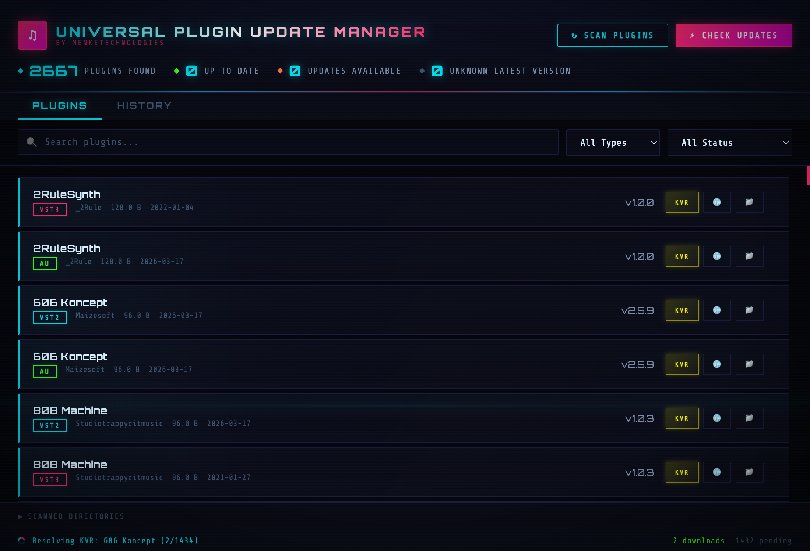
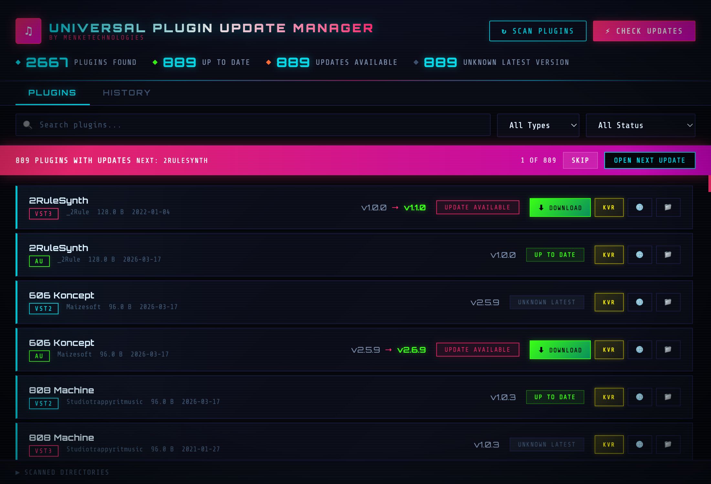
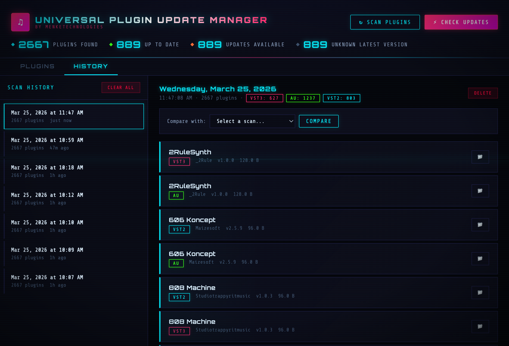

```
  ▄▄▄       █    ██ ▓█████▄  ██▓ ▒█████
 ▒████▄     ██  ▓██▒▒██▀ ██▌▓██▒▒██▒  ██▒
 ▒██  ▀█▄  ▓██  ▒██░░██   █▌▒██▒▒██░  ██▒
 ░██▄▄▄▄██ ▓▓█  ░██░░▓█▄   ▌░██░▒██   ██░
  ▓█   ▓██▒▒▒█████▓ ░▒████▓ ░██░░ ████▓▒░
  ▒▒   ▓▒█░░▒▓▒ ▒ ▒  ▒▒▓  ▒ ░▓  ░ ▒░▒░▒░

 ██░ ██  ▄▄▄      ▒██   ██▒ ▒█████   ██▀███
▓██░ ██▒▒████▄    ▒▒ █ █ ▒░▒██▒  ██▒▓██ ▒ ██▒
▒██▀▀██░▒██  ▀█▄  ░░  █   ░▒██░  ██▒▓██ ░▄█ ▒
░▓█ ░██ ░██▄▄▄▄██  ░ █ █ ▒ ▒██   ██░▒██▀▀█▄
░▓████▒   ▓█   ▓██▒▒██▒ ▒██▒░ ████▓▒░░██▓ ▒██▒
```

> **// SYSTEM ONLINE -- AUDIO_HAXOR v1.11.0 // by MenkeTechnologies**

A high-voltage **Tauri v2** desktop app that jacks into your system's audio plugin directories, maps every VST2/VST3/AU module it finds, scans audio sample libraries, discovers DAW project files, checks the web for the latest plugin versions, and maintains a full changelog of every scan -- so nothing slips through the cracks. Rust backend with a cyberpunk CRT interface featuring neon glow, scanline overlays, glitch effects, and multiple color schemes.

---

[](https://github.com/MenkeTechnologies/Audio-Haxor/actions/workflows/ci.yml)


## // VISUAL INTERFACE //

### `> BOOT SEQUENCE`


*Initial state -- the grid is dark, awaiting your scan command. Last scan auto-loads on startup.*

---

### `> SCANNING AUDIO NODES...`



*Plugins stream into the list in real-time as the background worker discovers them. Progress counter and bar show live status. Hit Stop to cancel anytime -- discovered plugins are kept.*

---

### `> UPDATE MATRIX LOADED`



*Checks KVR Audio for the latest version of each plugin. Cards update incrementally with `Update Available` or `Up to Date` badges as results arrive. Yellow `KVR` buttons link directly to the product page. A live status bar shows the current plugin being checked and running tallies.*

---

### `> SCAN HISTORY // DIFF ENGINE`



*Every scan is timestamped and archived. Select any two snapshots and the diff engine shows plugins added, removed, or version-changed between them.*

---

## // CORE MODULES //

| Module | Function |
|--------|----------|
| **Plugin Scanner** | Detects VST2, VST3, and AU plugins from platform-specific directories on macOS, Windows, and Linux. Shows architecture badges (ARM64, x86_64, Universal) per plugin via direct Mach-O/PE header parsing. Tracks raw byte sizes for accurate disk usage charts. Runs in a background worker thread -- UI stays fully responsive |
| **Audio Scanner** | Discovers audio samples (WAV, FLAC, AIFF, MP3, OGG, etc.) with metadata extraction including duration, channels, sample rate, bit depth from file headers. Symlink deduplication via canonicalize with string-based fallback. By default, **Single-Click Sample Playback** and **Play on Keyboard Selection** are on (Settings → Playback to disable). With keyboard selection, if the metadata row is expanded, it follows the highlighted row. Double-click still works when single-click is off. Floating music player with volume, playback speed, seek bar, and loop controls persists across all tabs |
| **DAW Scanner** | Finds DAW project files across 14+ formats -- Ableton (.als), Logic (.logicx), FL Studio (.flp), REAPER (.rpp), Cubase/Nuendo (.cpr/.npr), Pro Tools (.ptx/.ptf), Bitwig (.bwproject), Studio One (.song), Reason (.reason), Audacity (.aup/.aup3), GarageBand (.band), Ardour (.ardour), and dawproject (.dawproject). Double-click any project row to open it directly in its DAW |
| **Plugin Cross-Reference** | Extracts plugin references from 11 DAW formats: Ableton (.als — gzip XML), REAPER (.rpp — plaintext), Bitwig (.bwproject — binary scan), FL Studio (.flp — ASCII + UTF-16LE), Logic Pro (.logicx — plist + AU name matching), Cubase/Nuendo (.cpr — Plugin Name markers), Studio One (.song — ZIP XML), DAWproject (ZIP XML), Pro Tools (.ptx/.ptf — binary scan), Reason (.reason — binary scan). Detects VST2/VST3/AU/CLAP/AAX. Shows plugin count badges on DAW rows. Click to see full plugin list. Reverse lookup: right-click any plugin to find which projects use it. Build full index across all supported projects with one click |
| **Version Intel** | Reads version, manufacturer, and website URL from macOS bundle plists (`CFBundleShortVersionString`, `CFBundleIdentifier`, `NSHumanReadableCopyright`) |
| **Update Checker** | Searches [KVR Audio](https://www.kvraudio.com) for each plugin's latest version. Falls back to DuckDuckGo site-restricted KVR search. Runs in a worker thread with rate limiting and streams results back incrementally |
| **KVR Integration** | Yellow KVR button on every plugin links directly to its KVR Audio product page. Double-click any plugin card to open it on KVR. URL is constructed from plugin name + manufacturer with smart slug generation (camelCase splitting, manufacturer lookup table). Falls back to KVR search if the direct URL doesn't exist |
| **KVR Cache** | Resolved KVR data (product URLs, download links, versions) persisted to SQLite. On restart, cached results are restored instantly and the background resolver resumes from where it left off |
| **Download Button** | Green download button appears on plugins with a confirmed newer version and a KVR download link (platform-specific when available) |
| **Export/Import** | Export all tabs (plugins, samples, DAW projects, presets) to JSON, TOML, CSV, or TSV via native file dialogs. Import from JSON or TOML. Format auto-detected from file extension |
| **Scan History** | Stores scan snapshots in SQLite (plugins, audio, DAW, preset, PDF, and MIDI scans merged in one timeline) with full diff support between any two scans of the same type. Sidebar scan-type tags use `menu.tab_*` i18n keys (same strings as the main tabs) |
| **Batch Updater** | Walk through all outdated plugins one by one with skip/open controls |
| **Manufacturer Link** | Globe button on each plugin opens the manufacturer's website directly (derived from bundle ID). Shows a disabled icon when no website is available |
| **Reveal in Finder** | Folder button opens the plugin's filesystem location. Double-click any preset row to reveal it in Finder. Tooltip shows the full path on hover |
| **Directory Breakdown** | Expandable table showing plugin counts and type breakdown per scanned directory |
| **Stop Control** | Cancel any in-progress scan, update check, or KVR resolution without losing already-discovered results |
| **Auto-Restore** | Last scan results + KVR cache load automatically on app startup -- no need to re-scan or re-check every launch |
| **Unknown Tracking** | Plugins where no version info was found online show "Unknown Latest" badge and are counted separately from "Up to Date" |
| **Color Schemes** | Multiple themes including cyberpunk (default), light mode, and custom schemes with configurable CSS variables |
| **Fuzzy Search** | All search bars default to fuzzy matching (characters match in order, not contiguous). Toggle the `.*` button to switch to regex mode with full pattern support. Available in all tabs. Matched characters are highlighted (cyan) in list and table rows |
| **Favorites** | Right-click any plugin, sample, DAW project, or preset to add/remove from favorites. Dedicated Favorites tab shows all starred items with type filter, search, reveal in Finder, and remove actions. Persisted across sessions |
| **Resizable Columns** | Drag column borders to resize. Widths persist across sessions |
| **Floating Player** | Draggable audio player that docks to any corner with quadrant zone UI. Resizable from all 8 edges/corners. Play/pause, loop, shuffle (default **S**, customizable in Settings → Shortcuts), seek bar, volume, speed (0.25x-2x), recently played (50 tracks), song search with fzf matching, favorite/tag buttons. Expanded mode adds 3-band EQ, preamp gain, stereo pan, mono toggle, A-B loop. 60fps waveform playhead via requestAnimationFrame. Player state/size/dock persisted across sessions |
| **Waveform Preview** | 800-subdivision min/max envelope waveform with gradient fill (cyan→magenta) and RMS center detail line. Seekable — click anywhere to jump. 60fps playhead cursor. Right-click to toggle expand setting. File browser shows full-width waveform background behind each audio row with live playback cursor |
| **Dependency Graph** | Visual plugin dependency map with search, 4 tabs (Most Used, By Project with inline drill-down + back button, Orphaned, Analytics). Analytics tab shows format breakdown, top manufacturers, key insights (avg plugins/project, single-use, go-to plugins). Prompts to build plugin index if empty. Persisted xref cache |
| **Project Viewer** | Right-click any DAW project → "Explore Project Contents". XML formats (ALS, Studio One, DAWproject) show collapsible XML tree with search. Text formats (REAPER) show plaintext with search. Binary formats (Bitwig, FLP, Logic, Cubase, Pro Tools, Reason) show JSON tree of extracted metadata, plugins, and preset states. Collapse All/Expand All buttons. Color-coded: tags cyan, attributes yellow, values green |
| **Context Menus** | 40+ right-click context menus on every interactive element — plugins, samples, DAW projects, presets, **MIDI** (tab bar → rescan/export), favorites, notes, tags, history entries, audio player songs, dep graph rows, file browser rows, breadcrumbs, waveforms, spectrograms, EQ sliders, color schemes, shortcut keys, progress bars, metadata panels, similar panel, heatmap dashboard, header stats, **visualizer tiles** (export PNG, copy label, fullscreen, per-mode FFT/waveform/spectrogram/levels options), **smart playlist** items and editor, walker tiles, settings sections. **Tab bar** “scan this tab” uses the same `menu.scan_plugins`, `menu.scan_samples`, `menu.scan_daw`, `menu.scan_presets`, `menu.scan_pdf`, and `menu.scan_midi` keys as the Scan menu (not a single generic rescan string). **Scan toolbars** (`.audio-toolbar`) on Plugins, Samples, DAW, Presets, **MIDI**, and **PDF** tabs expose the same scan / export / import / find-duplicates menu (MIDI/PDF were added for parity). **All menu labels** use `appFmt('menu.*')` / `appFmt('ui.sp_*')` from `i18n/app_i18n_*.json` (SQLite `app_i18n`); rare DOM fallbacks use `menu.context_walker_fallback` / `menu.context_settings_section_fallback`. Optional `skipEchoToast` (`…_noEcho` on each item) suppresses duplicate post-click toasts when the action already shows a toast; the handler does not rely on English-only label matching. `scripts/apply_context_menu_i18n.py` can re-apply bulk label→key mapping after large edits |
| **Toast & UI i18n** | Slide-in toasts plus **visible** UI text: `index.html` uses `data-i18n` (labels), `data-i18n-placeholder`, and `data-i18n-title`; `scripts/gen_app_i18n_en.py` extracts strings, merges prior `ui.*` from `i18n/app_i18n_en.json`, injects attributes, and emits the English catalog. New keys are often added via `scripts/merge_i18n_keys.py` + `scripts/sync_locale_keys_from_en.py` (see `scripts/README-i18n.md`). Dynamic strings use `appFmt` with keys from `UI_JS_EN` in that script (e.g. plugin scan states, settings Light/Dark/On/Off). **JS-built UI** also uses `appFmt`: welcome dashboard stats and byte/uptime units (`ui.welcome.*`, `ui.unit.*`), keyboard shortcut labels (`ui.shortcut.*`), color scheme grid and fzf weight labels (`ui.scheme.*`, `ui.fzf.*`), export/import modals and PDF column headers (`ui.export.*`), heatmap dashboard (`ui.hm.*`), smart playlist empty state (`ui.sp.empty_state`), EQ band labels (`ui.eq.*`), **Settings → System / performance** and app-info panes (`ui.perf.*`), plus splash/dock/player chrome (`ui.splash.*`, `ui.dock.*`, `ui.np.*`), stats bar / header abbreviations (`ui.stats.*`, `ui.hdr.*`), tab empty-state copy (`ui.p.*`), audio scan/table/player strings (`ui.audio.*`), **sortable table column headers** in PDF/DAW/preset/MIDI tabs and the plugin-scan directory table (`appTableCol()` in `utils.js` with `ui.export.col_*`, `ui.col.*`, `ui.midi.th_time`), plus **header tooltips** (`title`) on audio/MIDI columns (`ui.audio.tt_sort_*`, `ui.midi.tt_sort_*`), settings cache/Data Files panes (`ui.settings.*`), and scan-status badge labels (`ui.scan_status.*`). Workflow for adding keys and locales: `scripts/README-i18n.md`. Confirm dialogs, help overlay, and native menu/tray labels load from SQLite `app_i18n`. The **command palette** (Cmd+K) uses the same `appFmt` keys for tab names, actions, placeholders (`ui.palette.*`), and type badges. Non-English locale catalogs (`cs`, `da`, `de`, `es`, `sv`, `fr`, `nl`, `pt`, `it`, `el`, `pl`, `ru`, `zh`, `ja`, `ko`, `fi`, `nb`, `tr`, `hu`, `ro`) are built from English via `scripts/gen_app_i18n_*.py` (venv + `deep-translator`; re-run when `app_i18n_en.json` grows), or stub-synced with `scripts/sync_locale_keys_from_en.py` (see `scripts/README-i18n.md` for per-locale commands). Settings → **Interface language** saves `uiLocale` to prefs only; **restart the app** to load strings. On launch, `reloadAppStrings` runs `applyUiI18n()`, `refreshSettingsUI()`, shortcut list refresh, and `refresh_native_menu` so the Web UI and **native menu bar** (File, Edit, Scan, View, …) match the saved locale |
| **Disk Usage** | Stacked bar charts showing space breakdown by format/type per tab. Visual representation of storage usage with color-coded legends |
| **Batch Selection** | Checkbox column in all tables for multi-item operations. Select all/deselect, batch favorite, copy paths, export selected as JSON |
| **Duplicate Detection** | Find duplicate files by name+size across plugins, samples, DAW projects, and presets. Modal report grouped by type with full paths |
| **Notes & Tags** | Add notes and comma-separated tags to any item (plugins, samples, DAW projects, presets, directories, files) via right-click. Visual badges (★ star, 📝 note, green tag pills) appear inline AFTER the name in all table rows, plugin cards, and file browser. Badges update in real-time when adding/removing favorites, tags, or notes |
| **Keyboard Navigation** | Arrow keys/j/k to navigate table rows and file browser (Ableton-style: right enters dir, left goes up). 49 customizable keybindings including Cmd+1-9/0 for all 10 tabs, E expand player, Q toggle EQ, U mono, D dashboard, B A-B loop, Cmd+P new playlist |
| **Help Overlay** | Press <kbd>?</kbd> to show all 49 keyboard shortcuts. Covers navigation, playback, actions, search operators, and mouse interactions |
| **Sort Persistence** | Last-used sort column and direction saved per tab, restored on app restart |
| **Multi-Select Filters** | All filter dropdowns support multiple selections (e.g. VST2 + AU, WAV + FLAC). Checkbox-based custom dropdown with "All" toggle |
| **Native Menu Bar** | Full menu bar (app, File, Edit, Scan, View, Playback, Data, Tools, Window, Help). Top-level and item labels use `menu.*` / `tray.*` in SQLite `app_i18n`; `refresh_native_menu` rebuilds the bar after `reloadAppStrings` at startup (saved `uiLocale`) |
| **ETA Timers** | Estimated time remaining on plugin scans and update checks. Elapsed time on audio, DAW, and preset scans |
| **Trello Drag & Drop** | Unified Trello-style drag and drop everywhere: tabs, settings sections, audio player sections, table columns (audio/DAW/preset), header stats, stats bars, favorites list, recently played queue, file browser bookmarks, tag cards, note cards, plugin cards, color presets. Floating ghost clone + dashed placeholder. All orders persisted |
| **Draggable/Resizable Modals** | All modal windows (dashboard, dep graph, ALS viewer, duplicate report, similarity, export/import) are draggable via header and resizable from 8 edges/corners. Position/size persisted to prefs per modal |
| **FD Limit Control** | Configurable file descriptor limit (256-65536) in Settings → Performance. Raised via setrlimit at startup. Prevents scan aborts on large libraries or network shares |
| **Cyberpunk Visualizer** | Animated equalizer bars in the floating player with cyan-to-magenta gradient. Bars bounce when playing, freeze on pause. Border glow pulse effect |
| **PDF Export** | Export any tab to PDF (A4 landscape, auto-sized columns proportional to content, 7pt font for maximum data density, background export with toast notification) |
| **TOML Export/Import** | Export/import all tabs in TOML format alongside JSON, CSV, TSV |
| **BPM Estimation** | Estimates tempo for all audio formats (WAV, AIFF, MP3, FLAC, OGG, M4A, AAC, OPUS) using symphonia decoder + onset-strength autocorrelation. Compressed formats decoded to PCM (30s max). Shown in metadata panel and table column. Cached to prefs across reboots. Background batch analysis starts as samples arrive |
| **LUFS Loudness** | Integrated loudness measurement (dBFS) per sample. Shown in metadata panel, table column (orange), and player meta line. Background analysis alongside BPM/Key. 8 tests: silence floor, sine wave levels, 6dB amplitude relationship, short files |
| **Visualizer Tab** | 6 real-time audio displays in 3×2 grid or single mode: FFT spectrum (log/linear), oscilloscope waveform (color picker), scrolling spectrogram (speed control), true stereo Lissajous (ChannelSplitter + dual AnalyserNodes), peak/RMS level meters (hold indicator), 10-band octave analyzer. 30fps throttle, pre-allocated buffers, zero CPU when tab hidden. Fullscreen mode (Escape to exit). Trello drag tiles. Context menus for per-tile params |
| **SQLite Backend** | All data stored in a single `audio_haxor.db` SQLite database (WAL mode, 64MB cache). Persists audio samples, plugins, DAW projects, presets, PDFs, MIDI files (FTS5-backed search; schema migration v13 backfills FTS5 shadow tables for pre-FTS or restored data so substring search still hits existing rows), per-domain scan history, KVR cache, waveform/spectrogram/xref/fingerprint caches, and app i18n. Inventory tables keep **one row per file per scan**; the Samples tab and paginated queries use the **library** (newest row per `path`, `MAX(id) GROUP BY path`), so the UI count can be lower than `COUNT(*)` on `audio_samples` when paths were rescanned. Settings → System Info shows both **raw table rows** and **library (unique paths)**. App preferences (`preferences.toml`) live in the same per-app data directory (`~/Library/Application Support/com.menketechnologies.audio-haxor` on macOS); the backend never uses the process working directory as a fallback so launch method cannot “reset” prefs or DB paths. Designed for multi-million-row libraries without browser OOM: the UI loads samples, DAW projects, presets, PDFs, and MIDI from the DB in pages (bounded JS memory during scans). Sample search uses a standalone `COUNT(*)` plus `LIMIT` (no `COUNT(*) OVER()`), so the engine does not materialize the full match before paging; the samples toolbar’s per-format counts use a debounced second query so filtering stays responsive on very large libraries. While any paginated `db_query_*` runs (plugins, samples, DAW, presets, PDFs, MIDI), the tab’s search box shows a compact spinner (`setFilterFieldLoading` in `frontend/js/utils.js`, with inline placement so release WebViews do not rely on `:has()` for positioning) and the list or table shows a loading row; `yieldForFilterFieldPaint` (double `requestAnimationFrame` + `setTimeout(0)`) runs before `invoke` so release WKWebView actually paints the spinner; the spinner uses a dedicated `filter-field-spin` keyframe so rotation does not clobber `translateY(-50%)` centering. Overlapping requests are dropped by sequence so slower queries cannot overwrite a newer filter. All paginated library queries (`db_query_plugins`, `db_query_audio`, `db_query_daw`, `db_query_presets`, `db_query_pdfs`, `db_query_midi`) and their toolbar aggregate helpers (`db_*_filter_stats`) run SQLite on Tokio’s blocking pool. After each IPC round-trip, each tab yields (`setTimeout(0)`) before rebuilding list/table DOM so filter fields stay interactive during large `innerHTML` work. Per-cache clear buttons in Settings (BPM, Key, LUFS, Waveform, Spectrogram, Xref, Fingerprint, KVR) |
| **Tab switching** | `switchTab` runs heavy per-tab setup after **two** `requestAnimationFrame` callbacks so the tab strip and active panel can paint before History IPC, Favorites rendering, or Settings layout work. Revisiting **History** repaints the last merged scan list immediately, then refreshes all six scan lists in the background without the global progress overlay (first visit or `loadHistory()` after a mutation still uses the overlay). Revisiting **Files** skips `listDirectory` IPC when the browser was already initialized for the current path (listing stays in the DOM while the tab is hidden); navigating, opening a favorite, or any action that calls `loadDirectory` still refreshes from disk. |
| **Walker Status Tab** | 4-tile live view of scanner threads: Plugin (cyan), Audio (yellow), DAW (magenta), Preset (orange). Shows thread count, dirs in buffer, full directory paths. Polls 500ms, auto-start/stop on tab switch. Right-click to copy paths |
| **Parametric EQ** | Visual frequency response curve with draggable band nodes (Low/Mid/High). Real-time FFT spectrum overlay at 60fps via Web Audio AnalyserNode. Log frequency axis (20Hz-20kHz), drag to change frequency and gain simultaneously |
| **Audio Similarity Search** | Right-click any sample → "Find Similar" to find samples that sound alike. Non-blocking floating panel (docked bottom-left, draggable, resizable, minimizable). Spectral fingerprinting: RMS energy, spectral centroid (normalized), zero-crossing rate, 3-band energy split, attack time. Parallel computation via rayon. Click results to play. Shortcut: W key |
| **Musical Key Detection** | Detects musical key (C Major, F# Minor, etc.) via Goertzel algorithm chromagram analysis across 7 octaves. Krumhansl-Kessler major/minor profile matching via Pearson correlation. Shown in metadata panel and player meta line alongside BPM. Cached per file. Supports all audio formats |
| **Heatmap Dashboard** | Full-screen analytics modal (95vw×95vh) with 8 cards: format distribution, size histogram, top folders, BPM histogram, key distribution (major cyan/minor magenta), activity timeline (last 24 months), plugin types, DAW formats. Bar widths relative to max, labels show count + percentage. Canvas-rendered histograms. Access via header button, D key, or right-click header |
| **Smart Playlists** | Rule-based auto-playlists with 10 rule types: format, BPM range, tag, favorite, recently played, name/path contains, min/max size, musical key. AND/OR match modes. Visual editor with live preview. 6 built-in presets. Context menu to add preset templates. Persisted to prefs |
| **Real FFT Spectrogram** | True frequency-domain spectrogram in metadata panel using Cooley-Tukey radix-2 FFT with Hann window, precomputed twiddle factors, log-frequency display mapping. Cyan→magenta color map. Spans same width as waveform |
| **File Browser Metadata** | Click any audio file to expand full metadata panel: format, size, sample rate, bit depth, channels, duration, byte rate, BPM, key, created/modified dates, permissions, path, favorite status, tags, notes. Full-width waveform background with playback cursor on each audio row |
| **Full Vim Keybindings** | j/k move, gg top, G bottom, Ctrl+D/U half-page, / search, o reveal, y yank path, p play, x favorite, v select, V select-all, w find-similar, e expand player, q EQ, u mono, d dashboard, b A-B loop. 49 total customizable keybindings |
| **Command Palette** | Press <kbd>Cmd+K</kbd> to open a fuzzy search across tabs, actions, bookmarked directories, and tags. For queries of **2+ characters**, inventory hits (plugins, samples, DAW projects, presets, PDFs, MIDI) are loaded from **SQLite** via the same paginated `db_query_*` commands as the main tabs — not from in-memory arrays, which after restart only hold the current page (or are empty). Arrow keys to navigate, Enter to select, Escape to dismiss. Uses the same fzf scoring engine as tab search bars |
| **Directory Bookmarks** | Bookmark favorite directories in the File Browser for instant navigation. Chips displayed above the file list, persisted across sessions. Right-click any folder to bookmark it |
| **Quick Nav Buttons** | File browser toolbar has Desktop, Downloads, Music, Documents, and Root (/) buttons for instant navigation |
| **Splash Screen** | Cyberpunk boot sequence with animated gradient title sweep, progress bar, version display. Fades out after init before data loads |
| **Cyberpunk Animations** | 30 CSS animations: neon focus pulse, button hover glow, modal zoom-in, context menu scale, format badge shimmer, toast glow pulse, neon gradient scrollbars, tactile depth shadows on every interactive element |
| **System Info** | Real-time display in 7 sections: System (OS, arch, hostname, CPU, disk), Process (PID, version, memory, threads, FD limits, uptime), Thread Pools (rayon, per-scanner, channel buffers), Scanner State (live dots), Scan Results (counts), Database (SQLite size, per-table row counts), Storage (data dir) |
| **App Info** | Architecture and feature reference: build details (version, Tauri version, target, profile), supported formats (10 audio, 5 plugin, 13 DAW, 14 preset), plugin extraction (12 DAW formats), analysis engines (BPM, Key, LUFS, Fingerprint), visualizers (6 types), export formats (5 types), storage backend, UI framework, search engine |
| **fzf Tuning** | 8 configurable fuzzy search parameters (match score, gap penalties, boundary/camelCase/consecutive bonuses) in Settings → Fuzzy Search with live preview and reset to defaults |
| **Filter Persistence** | All 6 filter dropdowns (plugin type, status, favorite type, audio format, DAW, preset format) saved to prefs and restored on startup. Multi-select values preserved |
| **Plugin Name Normalization** | Cross-reference matching normalizes plugin names: strips arch suffixes (x64, ARM64, Stereo), case-folds, collapses whitespace. "Serum", "SERUM (x64)", "serum" all match |
| **macOS Firmlink Dedup** | Scanners normalize `/System/Volumes/Data` paths to avoid duplicate traversal; the SQLite layer applies the same prefix strip when persisting path columns, scan roots, plugin directories, incremental `directory_scan_state`, analysis updates, and path-keyed caches so stored strings stay shorter and consistent |
| **Incremental unified scan** | Stores each visited directory’s mtime in SQLite (`directory_scan_state`); on the next unified scan, subtrees whose directory mtime is unchanged are skipped (faster on large trees and network shares) **only when** the last unified run finished with outcome `complete` (see `unified_scan_run` in [`incremental-scan.md`](incremental-scan.md)). Preference `incrementalDirectoryScan` (`on`/`off`, default `on` in `config.default.toml`). **Plugin-only** scans always `read_dir` each VST/AU root (they do not reuse this map — reusing it would skip roots after a prior unified walk or a prior plugin scan and show zero plugins) |
| **Scanner skip dirs** | Shared `scanner_skip_dirs::SCANNER_SKIP_DIRS` skips dependency trees (npm, Bower, JSPM, CocoaPods, Carthage, Composer, etc.), build output (`target`, CMake `cmake-build-*`, Bazel `bazel-*`, Buck `buck-out`, Zig `zig-*`, Mix `_build`, Nim `nimbledeps`/`nimcache`, `DerivedData`), test/coverage exports (`coverage`, `htmlcov`, `lcov-report`, `storybook-static`, …), Python tooling (`__pycache__`, …), caches, OS metadata (`lost+found`), and Time Machine / Synology dirs; hidden (`.`) and Synology `@` directories are skipped at traversal. Settings can add more directory names |
| **Browse Button** | Native folder picker in scan directory settings to grant macOS TCC permissions for mounted volumes |
| **Error Logging** | Global JS error handler logs uncaught errors and unhandled rejections to `app.log` in the data directory. Export/clear via Settings → Data. Includes timestamps |
| **Sortable Analysis Columns** | BPM, Key, Duration, Channels, LUFS columns in sample table are all clickable to sort ascending/descending. All column headers have tooltips |
| **Settings Export** | Export all preferences and keyboard shortcuts to a text file. Export app error log for debugging. Clear log button |
| **Sample Table Columns** | 12 columns: checkbox, Name, Format, Size, BPM, Key, Duration, Channels, LUFS, Modified, Path, Actions. All sortable, all with tooltips. BPM/Key/LUFS from background analysis, Duration/Channels from scan headers. All columns draggable to reorder |
| **Paginated History** | Scan detail views render in batches of 200 with scroll-to-load-more. No more UI freeze on 40,000+ sample scans |
| **Scan Button Mobility** | Scan All/Stop/Resume button group draggable between header, stats bar, and tab nav. Dashboard button same. Position persisted |
| **Cache Manager** | Settings → Database Caches: cache stats table first, then BPM/Key/LUFS title and description, then **Run analysis** / **Stop analysis** (left-aligned under that text; background batch; stop completes after the current batch). Per-row **Clear** on the table, plus **Clear All Caches** / **Clear All Databases** / **Refresh**. **Clear All Databases** wipes scan-history tables only; strings `ui.btn.clear_all_databases`, `ui.tt.clear_all_databases`, `confirm.clear_all_scan_databases`, `toast.all_scan_databases_cleared`, and `menu.clear_all_databases` (Data menu + command palette). All caches stored in SQLite |
| **Background Analysis** | Sequential BPM/Key/LUFS/metadata analysis starts as samples arrive during scan. Auto-pauses on user interaction, 50ms yield, saves every 50 samples. Cached to SQLite across reboots. Progress badge in header |
| **Neon Glow Animations** | Animated pulsing neon borders on all modals, panels, walker tiles, visualizer tiles, heatmap cards, context menus, and command palette. Staggered delays create wave effects. Toggle on/off in Settings → Appearance |
| **Resizable Recent List** | Audio player recently played list is vertically resizable via CSS resize handle (min 80px) |
| **Folder Watch / Auto-Scan** | Watch configured scan directories for new/changed files using native filesystem events (FSEvents on macOS, inotify on Linux, ReadDirectoryChangesW on Windows). 2-second debounce batches rapid changes. Classifies files by type (audio/daw/preset/plugin) and triggers targeted re-scan. Toggle in Settings → Scanning. Auto-starts on launch if enabled |
| **Cross-Platform** | Fully portable across macOS, Linux, and Windows. Process stats (RSS, CPU, threads, disk) via sysinfo crate on all platforms. File watcher uses native OS events. Scanner directories auto-detected per OS. All SQLite, audio analysis, and UI code is platform-agnostic |

---

## // QUICK START //

```bash
# Clone the repo
git clone https://github.com/MenkeTechnologies/Audio-Haxor.git
cd Audio-Haxor

# Install dependencies
pnpm install

# Run in development mode
pnpm tauri dev

# Build for distribution
pnpm tauri build
```

Requires [Node.js](https://nodejs.org/), [pnpm](https://pnpm.io/), and [Rust](https://rustup.rs/). The Tauri CLI is pulled in as a dev dependency.

---

## // DEV vs BUILD — IMPORTANT //

**Dev (`pnpm tauri dev`) and Build (`pnpm tauri build`) behave differently.** Always verify in the build before shipping.

### Differences

| | Dev | Build |
|---|---|---|
| URL scheme | `http://localhost` | `tauri://localhost` |
| CSP | Relaxed | Strict (no inline JS) |
| Frontend | Served from disk (live) | Embedded in binary |
| WebView cache | None (dev server) | Aggressive (survives app restart) |
| CSS layout | Standard web | Slightly different height inheritance |
| Canvas | `clientWidth` stable | `clientWidth` can fluctuate |

### Rules

1. **Never use inline `onclick`/`onchange`** — blocked by CSP in build. Always use `addEventListener` in JS files.
2. **Never set `canvas.width`/`canvas.height` in a render loop** — causes infinite resize loops in build. Set once, or use fixed HTML attributes with CSS `width:100%;height:100%`.
3. **Never rely on `height: 100%` cascading** — use explicit pixel values.
4. **Guard cross-file function calls** with `typeof fn === 'function'` — script load order differs.
5. **Don't use CSS classes on dynamically created elements** if the class has layout-affecting styles — use inline styles or dedicated CSS classes that only set visual properties.
6. **Never use `box-shadow`, `animation`, `transition`, `background-image` (gradient), `::before`/`::after` pseudo-elements, or `position: relative` on elements inside CSS `columns:` (multicol) layout** — WebKit's release renderer creates GPU compositing layers that corrupt child text, bar charts, and dynamic content (flicker, wrong sizes, black regions). Only plain `border`, `background-color`, and `padding` are safe there. **Settings** uses **CSS multicol** (`columns: 1/2/3/4` at responsive breakpoints) with `column-fill: balance` for equal-height columns and `break-inside: avoid` on sections. Sections are ordered to distribute tall panes (Color Scheme, Scan Directories, Performance, Keyboard Shortcuts) across different columns. Disables `.settings-heading` text glow and `.settings-row` border-glow **animation** inside `.settings-container` to keep System/App Info panes and neighbors stable in the WebView.
7. **Defer percentage-based widths on flex children inside modals** — `width:X%` on flex children (bar charts, progress bars) renders at wrong values on first paint because the flex container width isn't resolved yet. Set `width:0` initially, store the target in `data-bar-pct`, then apply via `requestAnimationFrame` after the modal is visible.

### Cache Busting

Build looks different from dev? Clear **all 4** WebView cache directories:

```bash
find ~/Library/WebKit/audio-haxor \
     ~/Library/WebKit/com.menketechnologies.audio-haxor \
     ~/Library/Caches/audio-haxor \
     ~/Library/Caches/com.menketechnologies.audio-haxor \
     -delete 2>/dev/null
```

Also bump the `?v=XXX` query strings on all `<script>` tags in `index.html` to bust compiled JS bytecode cache.

### Build Commands

```bash
# Normal build (~14s)
pnpm tauri build

# Clean build (when frontend changes aren't picked up, ~40s)
cargo clean --manifest-path src-tauri/Cargo.toml --release && pnpm tauri build

# Nuclear option: clear caches + clean build
find ~/Library/WebKit/audio-haxor ~/Library/WebKit/com.menketechnologies.audio-haxor \
     ~/Library/Caches/audio-haxor ~/Library/Caches/com.menketechnologies.audio-haxor \
     -delete 2>/dev/null
cargo clean --manifest-path src-tauri/Cargo.toml --release && pnpm tauri build
```

**Rust compile errors**

- **`couldn't read ... i18n/app_i18n_*.json`** — `src-tauri/src/app_i18n.rs` embeds every shipped locale at compile time (`include_str!`). Pull latest `main` so all `i18n/app_i18n_*.json` files are present; do not delete locale files locally.
- **`failed to build archive` / `failed to open object file` (.rlib)** — corrupted or partial `src-tauri/target` (often after an interrupted build). Remove the directory and rebuild: `command rm -rf src-tauri/target` then `pnpm tauri build`.

### Data Location

All data persists at:
```
~/Library/Application Support/com.menketechnologies.audio-haxor/
  audio_haxor.db        -- SQLite database (all scans, caches, history)
  preferences.toml      -- User preferences (human-readable config)
  app.log               -- Error log
```
This directory survives app reinstalls. Never deleted by builds.

### NPM Scripts

```bash
pnpm run clean      # Remove src-tauri/target, dist, node_modules/.cache
pnpm run rebuild    # Clean + full release build
pnpm test           # JS + Rust tests
pnpm run doc        # Rust API docs → src-tauri/target/doc/
pnpm run doc:open   # Same + open app_lib docs in browser
pnpm run doc:sync   # Regenerate rustdoc and copy to docs/api/ + use docs/index.html
```

---

## // TESTING //

```bash
pnpm test
cd src-tauri && cargo test
pnpm run test:js
```

---

## // API DOCUMENTATION (RUST — HTML) //

Rust API docs (rustdoc) are generated for the `app_lib` crate:

```bash
# Generate HTML under src-tauri/target/doc/ (opens in browser)
pnpm doc:open

# Regenerate and copy a browsable tree into docs/api/ (for GitHub Pages or offline)
pnpm doc:sync
```

After `pnpm doc:sync`, open `docs/index.html` in a browser, or open `docs/api/app_lib/index.html` directly. The canonical build output is always `src-tauri/target/doc/app_lib/index.html`.

---

## // BENCHMARKS //

Criterion micro-benchmarks on Apple M5 Max (18 cores, 64 GB):

| Operation | Time |
|-----------|------|
| `parse_version("1.2.3")` | 25 ns |
| `compare_versions` | 46 ns |
| `extract_version` (HTML) | 211 ns |
| `extract_version` (7KB HTML) | 2.5 µs |
| `extract_download_url` | 778 ns |
| `format_size` | 80 ns |
| `daw_ext_matches` | 38 ns |
| `daw_name_for_format` | 1.1 ns |
| `get_plugin_type` | 25 ns |
| `get_audio_metadata` (WAV) | 4.8 µs |
| `gen_id` | 42 ns |

Scanner architecture: each scanner (plugins, audio, DAW, presets) runs on its own dedicated rayon thread pool (`num_cpus × 2` threads, min 4) with `sync_channel(2048)` buffering and non-blocking `try_recv` drain loops. All 4 scanners run fully in parallel via `Promise.all`. Optimized for I/O-bound workloads including SMB/NFS network mounts where high thread counts overlap network round-trip latency.

```bash
cargo bench --manifest-path src-tauri/Cargo.toml
```

---

## // BUILD & DISTRIBUTE //

```bash
# Build optimized release bundle
pnpm tauri:build
```

Built packages land in `src-tauri/target/release/bundle/`:

| Platform | Format | Output |
|----------|--------|--------|
| macOS    | App Bundle | `AUDIO_HAXOR.app` |
| macOS    | DMG    | `AUDIO_HAXOR_x.x.x_aarch64.dmg` |
| Windows  | NSIS   | `AUDIO_HAXOR Setup x.x.x.exe` |
| Windows  | MSI    | `AUDIO_HAXOR_x.x.x_x64_en-US.msi` |
| Linux    | AppImage | `audio-haxor_x.x.x_amd64.AppImage` |
| Linux    | Debian   | `audio-haxor_x.x.x_amd64.deb` |

> Each platform builds natively. The macOS DMG is unsigned -- users right-click → Open on first launch to bypass Gatekeeper.

---

## // HOW IT WORKS //

```
[1] SCAN -----> Rust backend crawls platform-specific plugin directories.
                Streams results to the WebView via Tauri events in batches
                of 10. Collects name, type, version, manufacturer, website,
                size, and mod date.

[2] AUDIO ----> Separate scanner discovers audio samples (WAV, FLAC, AIFF,
                MP3, OGG) with metadata extraction. Inline playback via
                Tauri's native asset:// protocol for zero-latency local
                file streaming.

[3] DAW ------> DAW scanner finds project files across 14+ DAW formats
                (Ableton, Logic, FL Studio, REAPER, Cubase, Pro Tools,
                Bitwig, Studio One, Reason, Audacity, GarageBand, Ardour,
                dawproject). Tracks file sizes and modification dates.

[4] CHECK ----> Async Rust tasks search KVR Audio for each plugin's product
                page, scrape version info. Falls back to DuckDuckGo
                site:kvraudio.com search. Groups by manufacturer to reduce
                duplicate queries. Cards update in-place as results arrive.
                Status bar shows current plugin and live tallies.

[5] HISTORY --> Each scan is persisted to SQLite. Plugin, audio, DAW, preset,
                PDF, and MIDI scans are merged in the history timeline. Diff any
                two snapshots of the same type to see added/removed rows (plugins
                also show version changes). Last scan auto-restores on startup.

[6] EXPORT ---> Export any tab to JSON, TOML, CSV, TSV, or PDF via native
                file dialogs. Import from JSON or TOML.
```

---

## // KVR AUDIO RATE LIMITING //

This app queries [KVR Audio](https://www.kvraudio.com) to find plugin versions and
download links. To avoid overloading KVR's servers, strict rate limiting is enforced:

| Setting | Value |
|---------|-------|
| Concurrent requests | 1 (sequential) |
| Delay between plugins | 2 seconds |
| Delay between KVR page fetches | 1.5 seconds |
| Delay before DuckDuckGo fallback | 1.5 seconds |
| Max product pages checked per plugin | 2 |

The background KVR resolver (auto-runs on startup) also uses 2-second delays
between plugins. You can stop it anytime with the Stop button.

> With ~2600 plugins at 2s each, a full update check takes roughly 90 minutes.
> Results are cached on each plugin card -- subsequent clicks are instant.
> Use the Stop button to cancel early; already-resolved plugins keep their results.

---

## // PROJECT ARCHITECTURE //

```
src-tauri/
  src/
    main.rs            -- Tauri entry point
    lib.rs             -- IPC command handlers, export/import, file ops
    bpm.rs             -- BPM estimation via onset-strength autocorrelation
    scanner.rs         -- Plugin filesystem scanner (VST2/VST3/AU)
    scanner_skip_dirs.rs -- Shared directory-name blocklist for all recursive scanners
    audio_scanner.rs   -- Audio sample discovery + metadata extraction
    daw_scanner.rs     -- DAW project scanner (14+ formats)
    preset_scanner.rs  -- Plugin preset discovery
    similarity.rs      -- Audio similarity search via spectral fingerprinting
    xref.rs            -- Plugin ↔ DAW cross-reference engine (11 DAW formats)
    db.rs              -- SQLite database layer (paginated queries, 6M+ sample scale)
    file_watcher.rs    -- Filesystem watcher for auto-scan (FSEvents/inotify/ReadDirectoryChangesW)
    history.rs         -- Scan history persistence + diff engine
    key_detect.rs      -- Musical key detection via Goertzel chromagram
    lufs.rs            -- LUFS loudness measurement
    midi.rs            -- MIDI file parsing and metadata
    kvr.rs             -- KVR Audio scraper + version checker
  Cargo.toml           -- Rust dependencies
  tauri.conf.json      -- Tauri app configuration + CSP + bundling

frontend/
  index.html           -- Cyberpunk CRT UI (HTML/CSS)
  js/
    app.js             -- Startup, auto-load last scan, restore preferences; `applyInventoryCounts` keeps header strip + stats-bar totals from SQLite (`get_active_scan_inventory_counts`: one row per path, library scope — not tied to a single `scan_id`); scans stream-insert per batch; `applyInventoryCountsPartial` throttles DB refresh on progress
    audio.js           -- Audio sample scanning + inline playback + floating player
    batch-select.js    -- Checkbox selection + batch operations
    command-palette.js -- Cmd+K fuzzy search; 2+ char inventory hits use `db_query_*` (SQLite), not in-memory paginated arrays
    columns.js         -- Resizable table columns with width persistence
    context-menu.js    -- Right-click context menus for all elements
    daw.js             -- DAW project scanning + stats
    disk-usage.js      -- Stacked bar charts for storage breakdown
    duplicates.js      -- Duplicate detection modal
    export.js          -- Export/import (JSON/TOML/CSV/TSV/PDF); tab exports pull the full filtered result set from SQLite when the UI holds only a paginated page (plugins, presets, samples, DAW, MIDI, PDF)
    favorites.js       -- Favorites management
    file-browser.js    -- Filesystem navigation with tags + notes
    help-overlay.js    -- Keyboard shortcuts reference overlay
    history.js         -- Scan history management + merged timeline
    ipc.js             -- Tauri v2 IPC bridge + event delegation; `stopAll` stops every scanner plus KVR update check (`stop_updates`); native menu actions use `typeof` guards; Tauri `listen` unlisteners use `.catch` so teardown never rejects
    keyboard-nav.js    -- Arrow key / j/k table row navigation
    kvr.js             -- KVR Audio resolver + cache management
    multi-filter.js    -- Multi-select checkbox dropdowns
    notes.js           -- Note editor + tag management + tag cloud
    plugins.js         -- Plugin scanning, filtering, sorting, updates
    presets.js         -- Preset scanning + filtering
    settings.js        -- Color schemes, themes, toggles, preferences
    shortcuts.js       -- Customizable keyboard shortcuts
    sort-persist.js    -- Sort column/direction persistence per tab
    utils.js           -- fzf search, escaping, slugs, formatting
    xref.js            -- Plugin ↔ DAW cross-reference UI + project viewer (11 formats)
    dep-graph.js       -- Plugin dependency graph visualization
    visualizer.js      -- 6 real-time audio displays (FFT, waveform, spectrogram, Lissajous, levels, bands)
    walker-status.js   -- 4-tile live scanner thread status view
    heatmap-dashboard.js -- 8-card analytics dashboard
    smart-playlists.js -- Rule-based auto-playlists (10 rule types)
    drag-reorder.js    -- Unified Trello-style drag/drop + table column reorder
    modal-drag.js      -- Modal drag/resize with geometry persistence
```

---

## // SUPPORTED DIRECTORIES //

```
macOS
  /Library/Audio/Plug-Ins/VST
  /Library/Audio/Plug-Ins/VST3
  /Library/Audio/Plug-Ins/Components
  ~/Library/Audio/Plug-Ins/VST
  ~/Library/Audio/Plug-Ins/VST3
  ~/Library/Audio/Plug-Ins/Components

Windows
  C:\Program Files\Common Files\VST3
  C:\Program Files\VSTPlugins
  C:\Program Files\Steinberg\VSTPlugins
  C:\Program Files (x86)\Common Files\VST3
  C:\Program Files (x86)\VSTPlugins
  C:\Program Files (x86)\Steinberg\VSTPlugins

Linux
  /usr/lib/vst
  /usr/lib/vst3
  /usr/local/lib/vst
  /usr/local/lib/vst3
  ~/.vst
  ~/.vst3
```

---

## // LICENSE //

ISC

## // AUTHOR //

Created by [MenkeTechnologies](https://github.com/MenkeTechnologies)
