```
  ▄▄▄       █    ██ ▓█████▄  ██▓ ▒█████
 ▒████▄     ██  ▓██▒▒██▀ ██▌▓██▒▒██▒  ██▒
 ▒██  ▀█▄  ▓██  ▒██░░██   █▌▒██▒▒██░  ██▒
 ░██▄▄▄▄██ ▓▓█  ░██░░▓█▄   ▌░██░▒██   ██░
  ▓█   ▓██▒▒▒█████▓ ░▒████▓ ░██░░ ████▓▒░
  ▒▒   ▓▒█░░▒▓▒ ▒ ▒  ▒▒▓  ▒ ░▓  ░ ▒░▒░▒░

 ██░ ██  ▄▄▄      ▒██   ██▒ ▒█████   ██▀███
▓██░ ██▒▒████▄    ▒▒ █ █ ▒░▒██▒  ██▒▓██ ▒ ██▒
▒██▀▀██░▒██  ▀█▄  ░░  █   ░▒██░  ██▒▓██ ░▄█ ▒
░▓█ ░██ ░██▄▄▄▄██  ░ █ █ ▒ ▒██   ██░▒██▀▀█▄
░▓████▒   ▓█   ▓██▒▒██▒ ▒██▒░ ████▓▒░░██▓ ▒██▒
```

> **// SYSTEM ONLINE -- AUDIO_HAXOR v1.18.26 // by MenkeTechnologies**

A high-voltage **Tauri v2/JUCE** desktop app that jacks into your system's audio plugin directories, maps every VST2/VST3/AU/CLAP module it finds, scans audio sample libraries, discovers DAW project files, checks the web for the latest plugin versions, and maintains a full changelog of every scan -- so nothing slips through the cracks. Rust backend with a cyberpunk CRT interface featuring neon glow, scanline overlays, glitch effects, and multiple color schemes.

---

[](https://github.com/MenkeTechnologies/Audio-Haxor/actions/workflows/ci.yml)


## // VISUAL INTERFACE //

### `> PLUGIN GRID`


*VST2 / VST3 / AU / CLAP plugins streamed live into the grid by the background worker. Architecture badges (ARM64 / x86_64 / Universal) come from direct Mach-O / PE parsing. Yellow `KVR` button jumps to the product page, globe opens the manufacturer site, green download shows up when a newer build is confirmed.*

---

### `> SAMPLE VAULT`

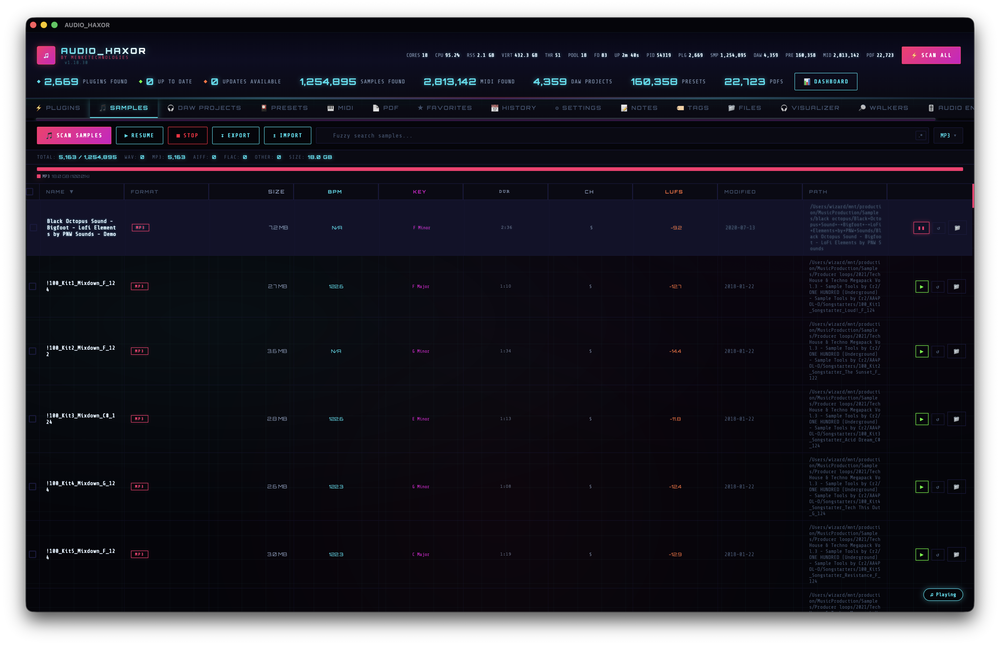

*Audio samples indexed with duration, channels, sample rate, and bit depth pulled from file headers. Single-click preview and keyboard-selection playback are on by default; double-click still works with single-click disabled. Every row is draggable to Finder, Desktop, or a DAW track as a native OS file drag.*

---

### `> DAW PROJECT INDEX`

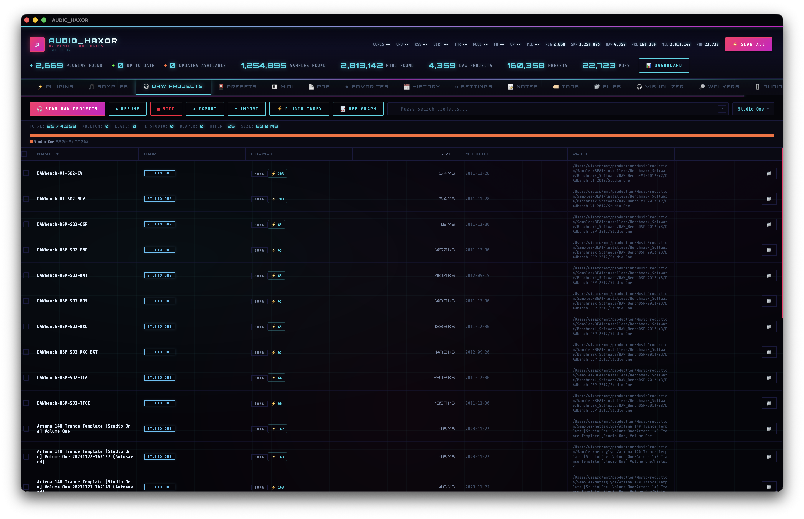

*14+ DAW project formats — Ableton, Logic, FL Studio, REAPER, Cubase/Nuendo, Pro Tools, Bitwig, Studio One, Reason, Audacity, GarageBand, Ardour, dawproject. Plugin-count badges come from the cross-reference engine that parses each project format. Double-click opens the project in its native DAW.*

---

### `> PRESET ARCHIVE`

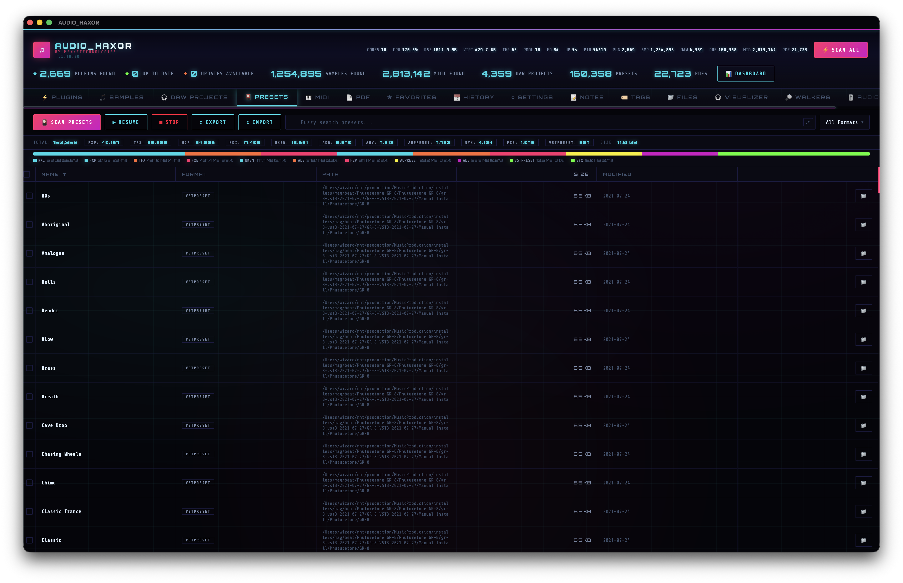

*Preset files indexed into SQLite with a stacked disk-usage bar and legend, format filter, and live scan progress. Chrome matches the DAW tab — same progress bar, stats row, and `table-cell` segmented bar that works reliably in WKWebView release builds.*

---

### `> MIDI MATRIX`

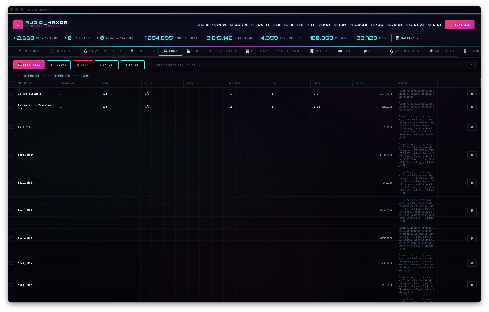

*SMF / MIDI files walked out of every configured directory with tempo, track count, and duration metadata. Drag rows straight into a DAW.*

---

### `> PDF LIBRARY`

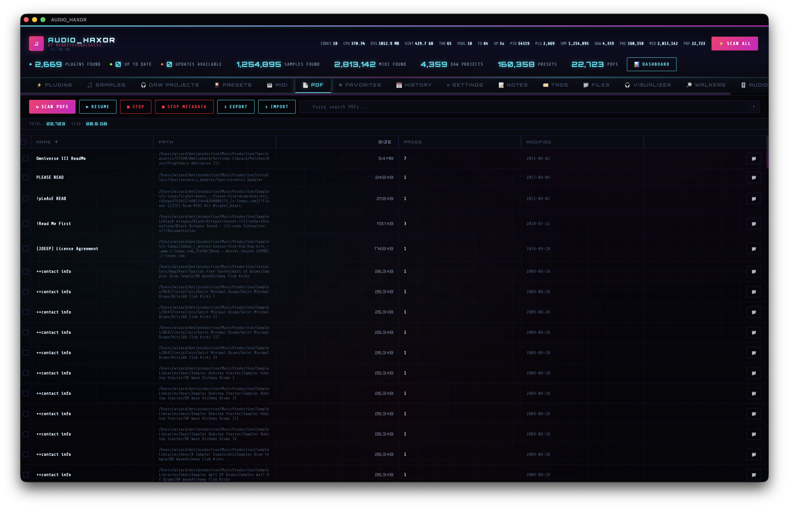

*Manuals, cheatsheets, and reference PDFs discovered across the filesystem with page count and size metadata. Draggable to any app that accepts file drops.*

---

### `> FAVORITES CACHE`

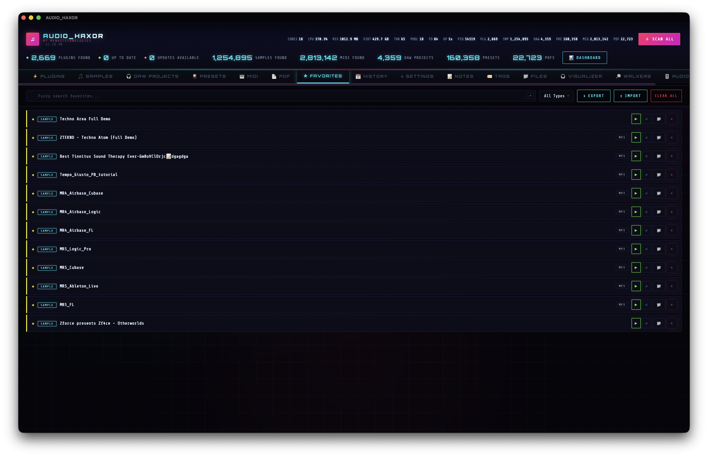

*Star anything from any tab — plugins, samples, projects, presets, MIDI, PDFs — and it lands here with its native row rendering, filters, and drag support preserved.*

---

### `> NOTES TERMINAL`

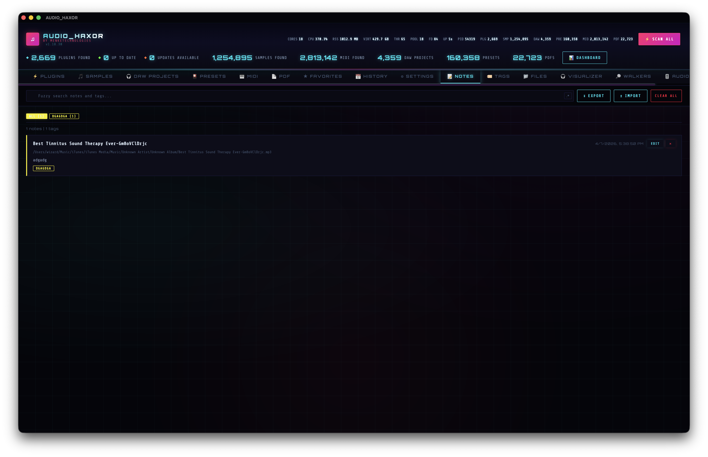

*Per-item notes with full-text search, attached to any scanned asset. Backed by SQLite, exports alongside the rest of the library.*

---

### `> TAG NETWORK`

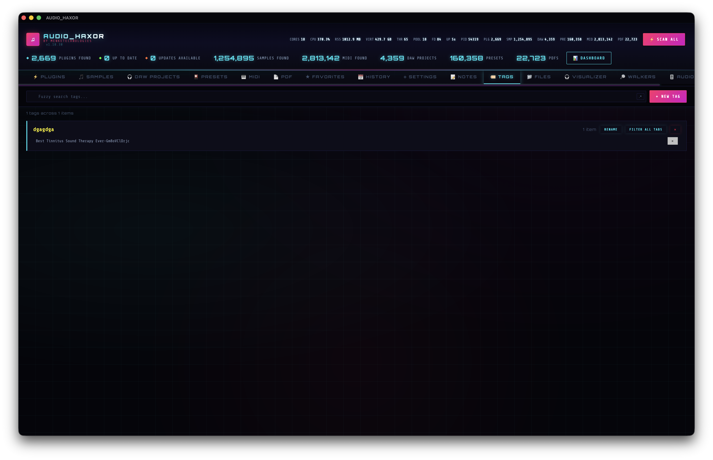

*User-defined tags applied across any tab. Filter by tag, rename in place, merge duplicates — the tag index is shared with every scanner tab.*

---

### `> FILE SYSTEM JACK`

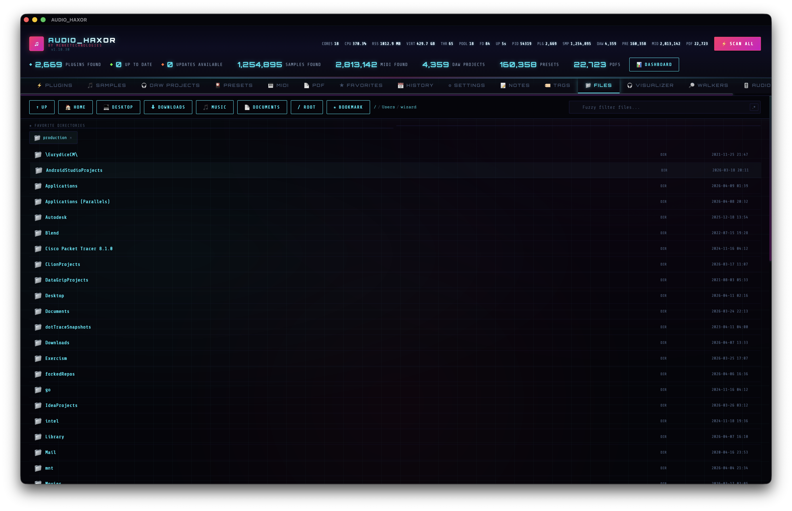

*Live filesystem browser with audio-format icons and format-badge styling driven by the same `AUDIO_EXTENSIONS` list as the Samples scanner and watcher. Drag any file straight out.*

---

### `> SCAN HISTORY // DIFF ENGINE`

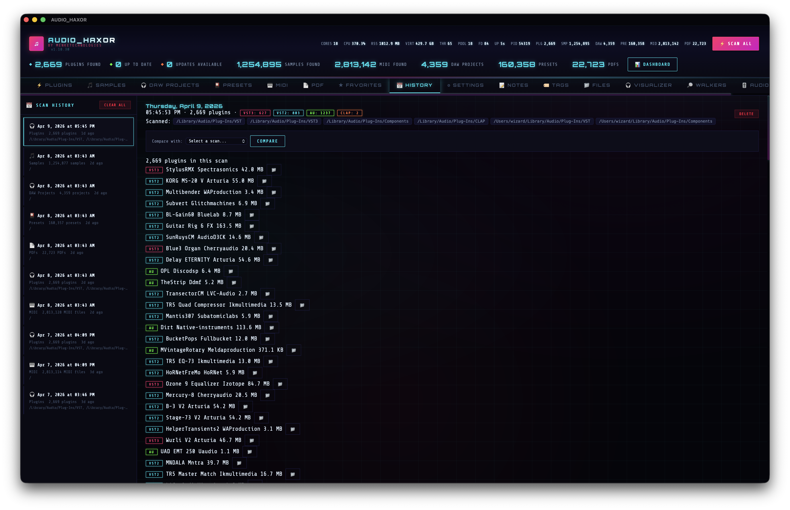

*Every plugin, audio, DAW, preset, MIDI, and PDF scan is timestamped and archived in a unified SQLite timeline. Pick any two snapshots of the same type and the diff engine shows what was added, removed, or version-changed.*

---

### `> SPECTRUM DECK`

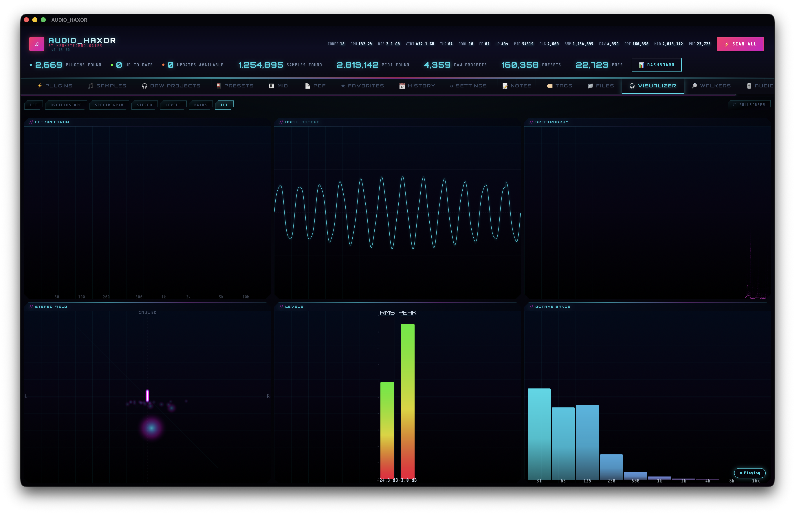

*Real-time audio visualizers driven by the Web Audio / AudioEngine playback pipeline — spectrum analyzer, waveform, and level meters rendered on fixed-size canvas elements to stay reliable in release WebView.*

---

### `> WALKER THREADS`

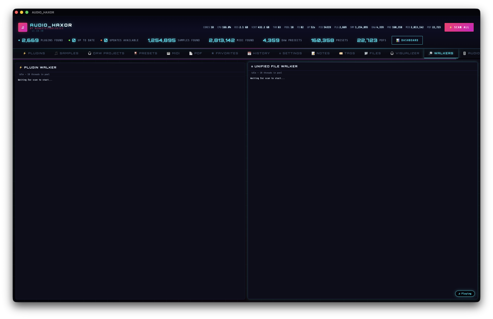

*Live view of every background walker — plugins, samples, DAW, presets, MIDI, PDF — with per-scanner thread pool stats, progress, and stop controls. Symlinks are resolved and broken links skipped uniformly across every walker.*

---

### `> AUDIO ENGINE CORE`

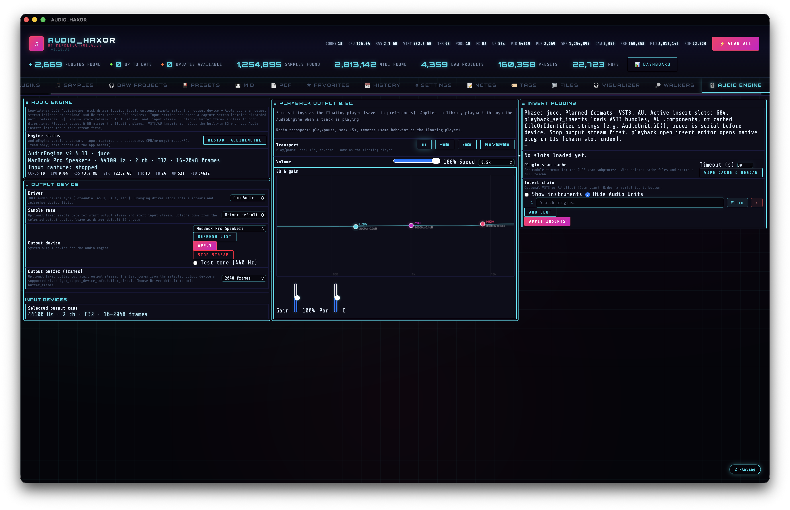

*JUCE-powered audio engine sidecar for low-latency playback and plugin hosting. Exposes playback status to the WebView over IPC for the floating player, autoplay next track, and EOF detection.*

---

### `> CONTROL PANEL`

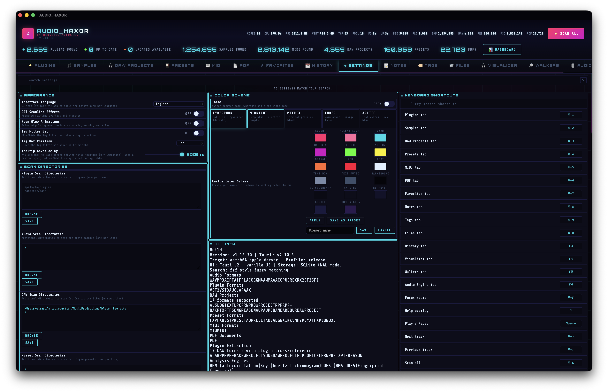

*Every toggle — playback behavior, single-click preview, autoplay next track, scanner directories, color scheme, keyboard shortcuts, export format defaults, locale. App Info block surfaces the shared `AUDIO_EXTENSIONS` and format lists so the UI never drifts from the Rust source of truth.*

---

### `> TRAY HUD`


*Menu-bar tray popover with quick playback controls, current track, and library shortcuts — same cyberpunk styling as the main window, scoped to the compact popover chrome.*

---

### `> FLOATING PLAYER`


*Persistent floating player across every tab: volume, playback speed, seek bar, loop, and autoplay-next controls. Advances on the `<audio>` `ended` event for Web Audio, or via the `playback_status.eof` poll when AudioEngine is active.*

---

## // CORE MODULES //

| Module | Function |
|--------|----------|
| **Plugin Scanner** | Detects VST2, VST3, AU, and CLAP plugins from platform-specific directories on macOS, Windows, and Linux. Shows architecture badges (ARM64, x86_64, Universal) per plugin via direct Mach-O/PE header parsing. Tracks raw byte sizes for accurate disk usage charts. Runs in a background worker thread -- UI stays fully responsive |
| **Audio Scanner** | Discovers audio samples (extensions in **`AUDIO_EXTENSIONS`** in `src-tauri/src/audio_extensions.rs` — shared with the unified walker, file watcher, and Settings → App Info; same list as the Samples format filter, Files-tab audio icons, and format-badge styling) with metadata extraction including duration, channels, sample rate, bit depth from file headers where applicable. **Symlinks** in scanned trees are resolved to their targets (files and subfolders); broken links are skipped — same behavior for unified **Scan All**, DAW, presets, MIDI, and PDF walkers (`readdir` does not mark symlink targets as files/dirs, so walkers `stat` links explicitly). Symlink deduplication via canonicalize with string-based fallback. By default, **Single-Click Sample Playback** and **Play on Keyboard Selection** are on (Settings → Playback to disable). With keyboard selection, if the metadata row is expanded, it follows the highlighted row. Double-click still works when single-click is off. **Drag files to a DAW, Finder, or Desktop:** on Samples, DAW, Presets, MIDI, PDF, Plugins, Favorites, Notes, Files, and from the similarity panel — move the pointer slightly (≈8px) before release, then drag from the row/card (not action buttons); native OS file drag. The drag **preview** is a canvas-rendered cyberpunk tile (neon frame, scanlines, mini spectrum, `COPY` badge) tinted from the active **color scheme** (`--cyan` / `--magenta` / `--accent`); it refreshes when you change schemes. Tabs with batch checkboxes drag all selected rows when the dragged row is part of the selection. Floating music player with volume, playback speed, seek bar, and loop controls persists across all tabs. **Autoplay Next Track** (Settings → Playback) advances on end-of-file via the `<audio>` **ended** event for Web Audio playback; with **AudioEngine** the muted `<audio>` element never ends, so autoplay uses **`playback_status.eof`** from the **`playback_status`** poll in **`audio-engine.js`** (`runEnginePlaybackStatusTick` → **`handleEnginePlaybackEofFromPoll`** in **`audio.js`**). The same setting also advances when a sample fails to start (unplayable type, decode error, or **`HTMLMediaElement.play()`** rejection). There is no separate host-side EOF thread — the WebView poll runs whenever library playback polling is active |
| **DAW Scanner** | Finds DAW project files across 14+ formats (see **`DAW_EXTENSIONS`** in `src-tauri/src/daw_scanner.rs`; the DAW tab’s application filter lists the corresponding **`daw_name_for_format`** names). Ableton (.als), Logic (.logicx), FL Studio (.flp), REAPER (.rpp), Cubase/Nuendo (.cpr/.npr), Pro Tools (.ptx/.ptf), Bitwig (.bwproject), Studio One (.song), Reason (.reason), Audacity (.aup/.aup3), GarageBand (.band), Ardour (.ardour), and dawproject (.dawproject). Pro Tools `.ptx`/`.ptf` rows require the session-file BOF signature (PRONOM / Library of Congress) so unrelated `.ptx` files (e.g. NVIDIA CUDA assembly) are excluded. Double-click any project row to open it directly in its DAW |
| **Preset Scanner** | Indexes preset files (extensions in **`PRESET_EXTENSIONS`** in `src-tauri/src/preset_scanner.rs` — same set as the Presets toolbar format filter and disk-usage legend keys) into SQLite. **Presets tab chrome matches DAW Projects:** `audio-progress-bar` under the toolbar while scanning, `audio-stats` row, then a stacked **disk-usage** bar and legend — segments are **`display: table-cell`** with inline **`width: %`** (full-width `table-layout: fixed` bar); flex-based sizing was unreliable in WKWebView. Legend/tooltip percentages use the sum of displayed segment bytes as the denominator (`bytesByType` from `db_preset_filter_stats`; incremental fallback uses per-format **counts**) |
| **Plugin Cross-Reference** | Extracts plugin references from 11 DAW formats: Ableton (.als — gzip XML), REAPER (.rpp — plaintext), Bitwig (.bwproject — binary scan), FL Studio (.flp — ASCII + UTF-16LE), Logic Pro (.logicx — plist + AU name matching), Cubase/Nuendo (.cpr — Plugin Name markers), Studio One (.song — ZIP XML: **`plugName=`** attributes only; generic `label=` / vendor `deviceName=` matches are skipped so badge counts match real inserts), DAWproject (ZIP XML), Pro Tools (.ptx/.ptf — binary scan), Reason (.reason — binary scan). Detects VST2/VST3/AU/CLAP/AAX. Shows plugin count badges on DAW rows. Click to see full plugin list. Reverse lookup: right-click any plugin to find which projects use it. Build full index across all supported projects with one click |
| **Version Intel** | Reads version, manufacturer, and website URL from macOS bundle plists (`CFBundleShortVersionString`, `CFBundleIdentifier`, `NSHumanReadableCopyright`) |
| **Update Checker** | Searches [KVR Audio](https://www.kvraudio.com) for each plugin's latest version. Falls back to DuckDuckGo site-restricted KVR search. Runs in a worker thread with rate limiting and streams results back incrementally |
| **KVR Integration** | Yellow KVR button on every plugin links directly to its KVR Audio product page. Double-click any plugin card to open it on KVR. URL is constructed from plugin name + manufacturer with smart slug generation (camelCase splitting, manufacturer lookup table). Falls back to KVR search if the direct URL doesn't exist |
| **KVR Cache** | Resolved KVR data (product URLs, download links, versions) persisted to SQLite. On restart, cached results are restored instantly and the background resolver resumes from where it left off |
| **Download Button** | Green download button appears on plugins with a confirmed newer version and a KVR download link (platform-specific when available) |
| **Export/Import** | Export all tabs (plugins, samples, DAW projects, presets, MIDI, PDFs) to JSON, TOML, CSV, or TSV via native file dialogs. Import from JSON or TOML. Format auto-detected from file extension. **Export modal row counts and SQLite fetch limits** use the **filtered** total (`totalCount` for the active search/filters), not the whole-library `totalUnfiltered`. Stale in-memory totals are refreshed with a one-row DB probe (same idea as DAW’s `dbDawFilterStats` path) |
| **Scan History** | Stores scan snapshots in SQLite (plugins, audio, DAW, preset, PDF, and MIDI scans merged in one timeline) with full diff support between any two scans of the same type. Sidebar scan-type tags use `menu.tab_*` i18n keys (same strings as the main tabs) |
| **Batch Updater** | Walk through all outdated plugins one by one with skip/open controls |
| **Manufacturer Link** | Globe button on each plugin opens the manufacturer's website directly (derived from bundle ID). Shows a disabled icon when no website is available |
| **Reveal in Finder** | Folder button opens the plugin's filesystem location. Double-click any preset row to reveal it in Finder. Tooltip shows the full path on hover |
| **Directory Breakdown** | Expandable table showing plugin counts and type breakdown per scanned directory |
| **Stop Control** | Cancel any in-progress scan, update check, or KVR resolution without losing already-discovered results. **Scan All** calls `prepare_unified_scan` before the delayed `scan_unified` invoke so Stop All during that window is not cleared when the walk starts (`scan_unified` no longer resets `stop_scan` at entry). The header **Stop All** button is not hidden when KVR resolve or an update check finishes while **Scan All** is still active (those flows share the same control; `hideStopButton` skips clearing it while `btnScanAll` is disabled). Startup `loadLastScan` uses the same rule so a late i18n load cannot hide Stop All after an early Scan All |
| **Post-scan toasts** | In-app slide-in toasts when each scanner finishes (`toast.post_scan_*` keys): full completion vs user-stopped, with locale-formatted counts. **Scan All** sets `window.__suppressPostScanToasts` so only one summary toast runs (library totals via `get_active_scan_inventory_counts`) |
| **Auto-Restore** | Last scan results + KVR cache load automatically on app startup -- no need to re-scan or re-check every launch |
| **Unknown Tracking** | Plugins where no version info was found online show "Unknown Latest" badge and are counted separately from "Up to Date" |
| **Color Schemes** | Multiple themes including cyberpunk (default), light mode, and custom schemes with configurable CSS variables. Modals, context menus, and the command palette use `color-mix`/`var(--bg-card)` for frosted panels (not a fixed dark tint) so light mode matches |
| **Fuzzy Search** | All search bars default to fuzzy matching (characters match in order, not contiguous). Toggle the `.*` button to switch to regex mode with full pattern support. **Regex mode** passes `search_regex: true` into the matching `db_query_*` / `db_*_filter_stats` IPC so SQLite applies case-insensitive `REGEXP` (Rust `regex` crate user function), not substring `LIKE` or FTS5 phrase search — same idea as **Samples**. **Favorites**, **Notes**, **Tags**, and **Files** (file browser: local directory listing + prefs-backed lists without `db_query_*`) use the same `.*` toggle and client-side `searchScore` / `highlightMatch` only. Matched characters are highlighted (cyan) in list and table rows |
| **Favorites** | Right-click any plugin, sample, DAW project, or preset to add/remove from favorites. Dedicated Favorites tab shows all starred items with type filter, search, reveal in Finder, and remove actions. Persisted across sessions |
| **Resizable Columns** | Drag column borders to resize. Widths persist across sessions |
| **Floating Player** | Draggable audio player that docks to any corner with quadrant zone UI. Resizable from all 8 edges/corners. Play/pause, loop, shuffle (default **S**, customizable in Settings → Shortcuts), **previous/next** follow the **Recently Played** list in the player (same order as the history list, including drag reorder; when the player search box has text, prev/next move through that search result order). **Autoplay next** (Settings → Playback, Command Palette) uses **`prefs.autoplayNextSource`**: **player** = sequential EOF advance through the floating **player list** (loops); **samples** = sequential EOF advance through **visible Samples table** rows (current sort/filter/page; loops). Shuffle picks at random **within that same list**. Failed-preview skip uses the same queue. **Autoplay**, **prev/next**, and **clicks on the player history list** update the queue entry in place (no move-to-top) so the order matches sequential advance; otherwise each track would jump to the front and EOF autoplay would alternate between the top two items. Seek bar, volume, speed (0.25x-2x), optional **reverse** playback (decodes the file and plays the buffer backwards through the same EQ chain), recently played (50 tracks), song search with fzf matching, favorite/tag buttons. Expanded mode adds 3-band EQ, preamp gain, stereo pan, mono toggle, A-B loop. 60fps waveform playhead via requestAnimationFrame. **Formats neither the WebView nor the AudioEngine (JUCE `registerBasicFormats`) can decode** (e.g. SF2/SFZ, REX/RX2, WMA, APE, Opus in this path, standard MIDI): preview selects the track in the floating player and sets the meta line to **`ui.audio.not_playable_in_audio_engine`** — no toast unless **Autoplay Next** skips to the following sample (then see error toast above). **Library playback through AudioEngine** drives the FFT from **`playback_status.spectrum`** (Web Audio’s analyser is not fed in that mode). **`engineSpectrumLive()`** in **`audio.js`** matches the Visualizer tab (active engine library session **or** **`_aeOutputStreamRunning`**) so the mini FFT and parametric EQ spectrum overlay use AudioEngine bins whenever the tap is live — **including when transport is paused**; **`fftAnimationPaused`** only freezes the curves, not global play/pause. The mini-spectrum FFT draws **log-spaced samples** with **linear bin interpolation** (horizontal resolution scales with strip width, capped in `audio.js`; **Web Audio** analyser **`fftSize` 8192** when the engine spectrum tap is not live); **magenta→cyan** spectrum fill + cyan outline (same family as the parametric EQ FFT fill). **Right-click** the mini FFT opens the same floating-player context menu as the rest of the bar; choose **Animate FFT spectrum** (same **`menu.viz_fft_animate`** as the Visualizer FFT tile) to toggle **`prefs.fftAnimationPaused`** and freeze or resume spectrum animation (mini strip, visualizer FFT, EQ spectrum fill). The engine-driven mini-FFT RAF loop stops while frozen so bins are not polled every frame. **`ensureAudioGraph()`** runs before FFT sampling (and the `AudioContext` is resumed when suspended) so local `<audio>` playback shows spectrum; parametric EQ knob drag uses **`pointermove` / `pointerup` on `window`** so mouse release works in WKWebView; FFT/EQ canvases track container width via **`ResizeObserver`**, **`getBoundingClientRect`**, and flex **`min-width: 0`**. **Engine `playback_status` spectrum** pins **`spectrum_sr_hz` / `spectrum_fft_size` once per session** for log-frequency mapping so the mini-FFT axis does not jitter when IPC metadata fluctuates. **Spectrum strip height** is adjustable via the drag handle under the FFT (32–480px, `npFftHeight`); **parametric EQ canvas** height uses the handle under the EQ plot (80–480px, `npEqCanvasHeight`). **Playing** border glow (`np-glow-pulse`) runs on a **`::before`** layer so the panel keeps its static multi-layer `box-shadow` — animating `box-shadow` on the panel was shifting the mini FFT / EQ column in WKWebView. Player state/size/dock persisted across sessions |
| **Waveform Preview** | 800-subdivision min/max envelope waveform with gradient fill (cyan→magenta) and RMS center detail line. Seekable — click anywhere on the now-playing bar to jump; the expanded sample metadata row waveform seeks the same way when that file is the current track. 60fps playhead cursor. Right-click to toggle expand setting. **Playback is highest priority:** now-playing and expanded-row waveform/spectrogram work is deferred with **`setTimeout(0)`** (not `requestIdleCallback`, which is often starved in Tauri/WKWebView so those draws never ran); pending timers are cleared with `clearTimeout` on track/row change so fetch/decode/FFT never run on the synchronous path right after `play()`. **`resolveWaveformBoxSize`** waits for rAF until the waveform container has non-zero dimensions (otherwise bar count was 0 and the canvas stayed blank). **`fileSrcForDecode`** uses **`__TAURI__.core.convertFileSrc`** first (then `window.convertFileSrc` from **`ipc.js`**). **Expanded** metadata row: when **single-click play** is on, **`toggleMetadata`** awaits **`previewAudio`** before **`expandMetaForPath`** so waveform/spectrogram work does not race **`enginePlaybackStart`** / **`audio.play()`**; **`drawMetaPanelVisuals`** prefers the **audio-engine** AudioEngine (**`audio_engine_invoke`**: **`waveform_preview`** + **`spectrogram_preview`** on the sample’s absolute path; spectrogram **`width_px`/`height_px`** are capped modestly via **`metaSpectrogramEnginePixelDims`** to keep IPC JSON small), then **`decodeMetaVisualsViaWorker`** / related worker paths; on failure it falls back to main-thread **`drawMetaWaveform`** → **`drawSpectrogram`** (shared **`_metaSharedDecoded`** buffer when both caches miss). **Prev/next** with an expanded row awaits **`previewAudio`** before re-expanding. **Now-playing** peaks: **`decodePeaksViaWorker`** — worker-first via **`frontend/js/audio-decode-worker.js`**, with main-thread fetch + transfer or decode fallbacks. **Files tab** list-row mini waveforms prefer **`audio_engine_invoke`** **`waveform_preview`** (JUCE decode on the AudioEngine process **worker thread**; stdin still awaits the response) when **`vstUpdater.audioEngineInvoke`** is available, then the same worker / main-thread path as now-playing. **Reverse** playback: **`decodeChannelsViaWorker`** + chunked **`copyFloat32ToBufferChannelAsync`** into the playback buffer and **`reverseAudioBufferAsync`** (yields during long reversals); if no **`Worker`**, **`decodeAudioData`** on the main thread. **`preloadAudioDecodeWorker`**: idle + ~650ms after splash fade. Each new track bumps a generation counter so in-flight decode for a previous track is abandoned |
| **Dependency Graph** | Visual plugin dependency map with search, 4 tabs (Most Used, By Project with inline drill-down + back button, Orphaned, Analytics). Analytics tab shows format breakdown, top manufacturers, key insights (avg plugins/project, single-use, go-to plugins). Prompts to build plugin index if empty. Persisted xref cache. Graph data uses **xref cache paths**; project names come from the DAW list when the row is loaded, otherwise from the file path (paginated SQLite DAW tab does not keep every project in `allDawProjects`). **Plugin identity** for aggregation, orphaned-vs-installed matching, and **reverse “projects using this plugin”** uses **`xrefPluginRefKey`**: Rust `normalizedName` when present, otherwise the same **`normalizePluginName`** rules as `xref.rs` (not raw `toLowerCase()`), so counts stay consistent with the scanner. **Most Used** row `title` tooltips list projects with a single `escapeHtml` pass per name (no double-encoded entities). **Analytics → Project extremes** pluralizes “plugin(s)” for both heaviest and lightest rows |
| **Project Viewer** | Right-click any DAW project → "Explore Project Contents". XML formats (ALS, Studio One, DAWproject) show collapsible XML tree with search. Text formats (REAPER) show plaintext with search. Binary formats (Bitwig, FLP, Logic, Cubase, Pro Tools, Reason) show JSON tree of extracted metadata, plugins, and preset states. Collapse All/Expand All buttons. Color-coded: tags cyan, attributes yellow, values green |
| **Context Menus** | 40+ right-click menus on named surfaces — plugins, samples, DAW projects, presets, **MIDI** (tab bar → rescan/export), favorites, notes, tags, history entries, audio player songs, dep graph rows, file browser rows, breadcrumbs, waveforms, spectrograms, EQ sliders, color schemes, shortcut keys, progress bars, metadata panels, similar panel, heatmap dashboard, header stats, **visualizer tiles** (export PNG, copy label, fullscreen, per-mode FFT/oscilloscope/spectrogram/levels options), **smart playlist** items and editor, walker tiles, settings rows (toggles, selects, ranges, action buttons), settings sections. **Universal fallback**: any other right-click inside the app shell (empty tab area, dock overlay, tag bar gaps, etc.) still opens a menu (copy selection / value / visible text, activate `data-action` controls, focus, Command Palette, keyboard shortcuts, Settings). **Settings rows** without only a toggle or textarea now include copy/focus/reset for selects and ranges. **Tab bar** “scan this tab” uses the same `menu.scan_plugins`, `menu.scan_samples`, `menu.scan_daw`, `menu.scan_presets`, `menu.scan_pdf`, and `menu.scan_midi` keys as the Scan menu (not a single generic rescan string). **Scan toolbars** (`.audio-toolbar`) on Plugins, Samples, DAW, Presets, **MIDI**, and **PDF** tabs expose the same scan / export / import / find-duplicates menu (MIDI/PDF were added for parity). **All menu labels** use `appFmt('menu.*')` / `appFmt('ui.sp_*')` from `i18n/app_i18n_*.json` (SQLite `app_i18n`); rare DOM fallbacks use `menu.context_walker_fallback` / `menu.context_settings_section_fallback`. Optional `skipEchoToast` (`…_noEcho` on each item) suppresses duplicate post-click toasts when the action already shows a toast; the handler does not rely on English-only label matching. `scripts/apply_context_menu_i18n.py` can re-apply bulk label→key mapping after large edits |
| **Toast & UI i18n** | Supported locale codes are defined once in `frontend/js/ipc.js` as `SUPPORTED_UI_LOCALES` (also exposed as `window.SUPPORTED_UI_LOCALES`). Slide-in toasts are suppressed and the toast container cleared while **`isUiIdleHeavyCpu()`** is true (`ui-idle.js` — hidden page, minimized window, unfocused WebView, or Tauri `!isVisible`). **Visible** UI text: `index.html` uses `data-i18n` (labels), `data-i18n-placeholder`, and `data-i18n-title`; `scripts/gen_app_i18n_en.py` extracts strings, merges prior `ui.*` from `i18n/app_i18n_en.json` plus any other keys the generator does not emit (batch-merged `menu.*` / `confirm.*`, etc.), injects attributes, and emits the English catalog. New keys are often added via `scripts/merge_i18n_keys.py` + `scripts/sync_locale_keys_from_en.py` (see `scripts/README-i18n.md`). Dynamic strings use `appFmt` with keys from `UI_JS_EN` in that script (e.g. plugin scan states, settings Light/Dark/On/Off). **JS-built UI** also uses `appFmt`: welcome dashboard stats and byte/uptime units (`ui.welcome.*`, `ui.unit.*`), keyboard shortcut labels (`ui.shortcut.*`), color scheme grid and fzf weight labels (`ui.scheme.*`, `ui.fzf.*`), export/import modals and PDF column headers (`ui.export.*`), heatmap dashboard (`ui.hm.*`), smart playlist empty state (`ui.sp.empty_state`), EQ band labels (`ui.eq.*`), **Settings → System / performance** and app-info panes (`ui.perf.*`), plus splash/dock/player chrome (`ui.splash.*`, `ui.dock.*`, `ui.np.*`), stats bar / header abbreviations (`ui.stats.*`, `ui.hdr.*`), tab empty-state copy (`ui.p.*`), audio scan/table/player strings (`ui.audio.*`), **sortable table column headers** in PDF/DAW/preset/MIDI tabs and the plugin-scan directory table (`appTableCol()` in `utils.js` with `ui.export.col_*`, `ui.col.*`, `ui.midi.th_time`), plus **header tooltips** (`title`) on audio/MIDI columns (`ui.audio.tt_sort_*`, `ui.midi.tt_sort_*`), settings cache/Data Files panes (`ui.settings.*`), and scan-status badge labels (`ui.scan_status.*`). Workflow for adding keys and locales: `scripts/README-i18n.md`. Confirm dialogs, help overlay, and native menu/tray labels load from SQLite `app_i18n`. The **command palette** (Cmd+K) uses the same `appFmt` keys for tab names, actions, placeholders (`ui.palette.*`), and type badges. Non-English locale catalogs (`cs`, `da`, `de`, `es`, `sv`, `fr`, `nl`, `pt`, `it`, `el`, `pl`, `ru`, `zh`, `ja`, `ko`, `fi`, `nb`, `tr`, `hu`, `ro`) are built from English via `scripts/gen_app_i18n_*.py` (venv + `deep-translator`; re-run when `app_i18n_en.json` grows), or stub-synced with `scripts/sync_locale_keys_from_en.py` (see `scripts/README-i18n.md` for per-locale commands). Settings → **Interface language** saves `uiLocale` to prefs only; **restart the app** to load strings. On launch, `reloadAppStrings` runs `applyUiI18n()`, `refreshSettingsUI()`, shortcut list refresh, and `refresh_native_menu` so the Web UI and **native menu bar** (File, Edit, Scan, View, …) match the saved locale |
| **Disk Usage** | Stacked bar charts showing space breakdown by format/type per tab. Visual representation of storage usage with color-coded legends |
| **Batch Selection** | Checkbox column in inventory tables (Samples, DAW, Presets, MIDI, PDF) for multi-item operations. **Selections are stored per tab** (`batchSetForTabId` in `batch-select.js`) — the floating bar count and actions apply only to the **active** table; switching tabs clears selection (`switchTab` → `deselectAll`). Select all/deselect, batch favorite, copy paths, **Export** (opens the same format modal as the tab toolbar — JSON/TOML/CSV/PDF — for **only** the selected rows), export selected as JSON to clipboard. **Favorite**, **Export**, and **export JSON** resolve each selected path via `resolveBatchInventoryItems`: `filtered*` then `all*` arrays, then visible table rows (so paginated SQLite and rows from earlier “load more” pages still match) |
| **Duplicate Detection** | **By name:** plugins with the same name; samples, DAW projects, and presets with the same name+format. **By content:** optional SHA-256 pass over the whole library (plugins, samples, DAW, presets, PDFs, MIDI) — groups by stored size first, then hashes only size collisions. Modal has two tabs; byte scan streams progress events |
| **Notes & Tags** | Add notes and comma-separated tags to any item (plugins, samples, DAW projects, presets, directories, files) via right-click. Visual badges (★ star, 📝 note, green tag pills) appear inline AFTER the name in all table rows, plugin cards, and file browser. Badges update in real-time when adding/removing favorites, tags, or notes |
| **Keyboard Navigation** | Arrow keys and **j/k without Cmd/Ctrl** to navigate table rows and file browser (Ableton-style: right enters dir, left goes up) — **Cmd+K** / **Ctrl+K** toggles the command palette (works even when the palette search box is focused; handled in `shortcuts.js` before the input guard). On the **Samples** tab, movement keys apply to the main library table (not the audio player’s recently played list). Customizable shortcuts (Settings → Keyboard Shortcuts) cover tabs (including F-key rows for later tabs), playback, scans, palette, and actions; **palette-only** flows (per-scanner scans, PDF metadata tools, exports, cache clears, Settings toggles, etc.) have defaults using **⌘⇧** (Ctrl+Shift) or **⌘⇧F7–F12** pairs so they do not collide with existing single-modifier chords. The help overlay summarizes defaults plus a “more” block bound to the same catalog |
| **Help Overlay** | Press <kbd>?</kbd> for a shortcuts reference (navigation, playback, actions, fzf operators, mouse, and **More shortcuts** populated from Settings). Full list and rebinding live under **Settings → Keyboard Shortcuts** |
| **Sort Persistence** | Last-used sort column and direction saved per tab (`sort_*` in prefs via `sort-persist.js`), restored on app restart. **Settings → Sorting** also defines default column order when no saved runtime sort exists: `pluginSort` / `audioSort` / `dawSort` / `presetSort` / `midiSort` / `pdfSort` (see `[sorting]` in `config.default.toml`) |
| **Multi-Select Filters** | All filter dropdowns support multiple selections (e.g. VST2 + AU, WAV + FLAC). Checkbox-based custom dropdown with "All" toggle. **Plugins → status** filters against `kvr_cache` in SQLite (same `manufacturer|||name` key as the KVR updater) so `totalCount` and paging stay aligned with the UI |
| **Native Menu Bar** | Full menu bar (app, File, Edit, Scan, View, Playback, Data, Tools, Window, Help). Every **custom** menu item has a native **accelerator** in `src-tauri/src/native_menu.rs` (muda/Tauri format, e.g. `CmdOrCtrl+Shift+E` for **Export Samples**, `F1` for **Toggle CRT**, `CmdOrCtrl+F6` for **Audio Engine** tab, `CmdOrCtrl+Shift+/` for **Keyboard Shortcuts** in Tools, triple-modifier chords for destructive **Data → Clear …** actions). Standard Edit/Window predefined items keep OS defaults. On **macOS**, the **tray** sits in the **menu bar** (status bar): bundled **32×32** PNG (full-color, not a template mask so the glyph stays visible), **Previous / Play-Pause / Next**, show window, scan/stop, quit; **track name + elapsed/total** and **Playing/Paused** sync via `update_tray_now_playing` from `syncTrayNowPlayingFromPlayback` in `audio.js` (single-line **tooltip** + optional **title** next to the icon + the same short line as the **first row** of the tray **dropdown** menu; on **macOS** / **Windows** a **left-click** toggles a compact **WebView** popover (`frontend/tray-popover.html` — ~**280×220** logical default, single-frame HUD, CRT scanlines, JetBrains Mono readout, cyan/magenta accents) with title, `#npMetaLine` meta, scrubber, and transport; **`tray_popover_resize`** / **`tray_popover_get_state`**: popover sync uses **`emit_to("tray-popover", …)`** (not broadcast-only `emit`) so the secondary WebView receives updates; measures `#shell` after layout/fonts with padding for **outer `box-shadow`**; Rust uses **logical** `LogicalSize` for HiDPI. Tray popover window uses **`shadow: false`**; **`tray-popover.html`** uses **`--cp-bg0`** for `html`/`body` so WKWebView does not flash a white rim; **`tray_popover_action`** uses **`emit_to("main", "menu-action", …)`** so transport matches native menu delivery (main webview runs `ipc.js`). **right-click** opens the full menu (**Linux:** tray click events are unavailable—left-click opens the menu). Duration uses library metadata when `<audio>` has not exposed length yet; IPC dedupe includes total duration **and** popover title/subtitle strings so the tray updates when length loads or when `#npName` / meta fill in after the first tick). **Tray idle:** `syncTrayNowPlayingFromPlayback` is false when the AudioEngine transport or reverse-buffer playback is active, not only when `audioPlayerPath` is set; `window._enginePlaybackResumePath` backs the tray line when the path is missing after reconnect. **IPC payload shape:** `update_tray_now_playing` takes a single `TrayNowPlayingPayload` struct parameter named `payload` — Tauri v2 requires struct command args to be wrapped under the Rust parameter name (`invoke('update_tray_now_playing', { payload: {...} })`), **not** passed flat. Passing flat produces `"missing required key payload"` and the tray stays frozen at its last emitted state — the `.catch(() => {})` on the JS side silently swallows the error. **Tray idle keepalive:** the rAF playback loop and the 250 ms engine poll both stop while `isUiIdleHeavyCpu()` is true (always the case when the tray popover is open — focus moves to the popover WebView), so two backup paths keep the tray live: (1) a **host-side** polling thread in `src-tauri/src/tray_menu.rs` (`start_tray_host_poll` → spawned from `setup()`) polls `audio-engine` `playback_status` every 500 ms, merges the fresh elapsed/total/paused with the last JS-reported `title`/`subtitle` from `TrayState.last_popover_emit`, and calls `tray.set_title` + `tray.set_tooltip` + `emit_to("tray-popover", ...)` directly (short-circuits when JS last reported an idle state so the audio-engine child is not woken up on empty); (2) a frontend `audioPlayer.addEventListener('timeupdate', ...)` listener for the HTML5 / reverse-buffer paths, since `HTMLMediaElement timeupdate` fires independently of rAF / focus. Top-level and item labels use `menu.*` / `tray.*` in SQLite `app_i18n`; `refresh_native_menu` rebuilds the bar and tray after `reloadAppStrings` at startup (saved `uiLocale`) |
| **ETA Timers** | Estimated time remaining on plugin scans and update checks. Elapsed time on audio, DAW, and preset scans |
| **Trello Drag & Drop** | Unified Trello-style drag and drop everywhere: tabs, **Settings** + **Audio Engine** whole **pane** order (`.settings-section` siblings; prefs `settingsSectionOrder` / `audioEngineSectionOrder`; drag handle = direct child `.settings-heading` so `<details>` summaries inside a pane still toggle), **rows** within each settings section (`settingsRows_<section>`), audio player sections, table columns (audio/DAW/preset/MIDI/PDF), header stats, **main** stats bar (`.stat` units), **inventory** stats rows (Plugins / Samples / DAW / Presets / MIDI / PDF — each **key:value** is one draggable `.audio-stats-pair` with stable `data-stat-key`, not nested label/value spans), favorites list, recently played queue, file browser bookmarks, tag cards, note cards, plugin cards, color presets. Floating ghost clone + dashed placeholder. Layout orders persisted in prefs (`pluginStatsOrder`, `audioStatsOrder`, `dawStatsOrder`, `presetStatsOrder`, `midiStatsOrder`, `pdfStatsOrder`, `statsBarOrder`, …). Column-drag uses `mousedown` tracking **without** `preventDefault()` so delegated header `click` handlers (sort by column) still run in WKWebView |
| **Draggable/Resizable Modals** | `frontend/js/modal-drag.js` observes the DOM and calls `initModalDragResize` on each `.modal-content` (and the floating player via `initModalDragResize(audioNowPlaying)`). Drag uses `.modal-header`; resize uses **8** handles (N/S/E/W + **four corners**). Geometry is saved per overlay `id` (e.g. `heatmapDashModal`, `depGraphModal`). **Command palette** uses `.palette-box`, not `.modal-content`, so it is separate. **Smart playlist** editor uses the same `.modal-content` / `.modal-header` / `.modal-body` shell as other modals, including **`modal-wide`** plus **`.smart-playlist-modal`** (same max width/height as **Plugin Dependency Graph**’s `.dep-graph-modal`). Covers: heatmap dashboard, dep graph, xref, project/XML viewers, notes, tag wizard, export/import, help, duplicates, smart playlist, etc. |
| **FD Limit Control** | Configurable file descriptor limit (256-65536) in Settings → Performance. Raised via setrlimit at startup. Prevents scan aborts on large libraries or network shares |
| **Table page size** | Settings → Performance: one **Table Page Size** slider (default **200**, range 100–2000) applies to Samples, DAW, Presets, Plugins, MIDI, and PDF |
| **Cyberpunk Visualizer** | Animated equalizer bars in the floating player with cyan-to-magenta gradient. Bars bounce when playing, freeze on pause. Border glow pulse effect |
| **PDF Export** | Export any tab to PDF (A4 landscape, auto-sized columns proportional to content, 7pt font for maximum data density, background export with toast notification) |
| **PDFs tab (metadata)** | Background **`lopdf`** indexing fills the **Pages** column (`pdf_metadata` in SQLite). **Settings → Scan Directories → Background PDF metadata (auto)** (`pdfMetadataAutoExtract`, default **on** in `config.default.toml`) is the **only** gate for automatic extraction (not whether the PDF tab is selected). When **on**, batch extraction **continues** while **`isUiIdleHeavyCpu()`** is true (hidden tab, unfocused/minimized window—same signal as the visualizer). When **off**, automatic extraction does not run; **`isUiIdleHeavyCpu()`** still blocks **starting** a run and **aborts** an in-flight batch (same as other heavy background work). Only **Command Palette → Extract PDF metadata** runs a full manual pass (`forceNoIdle`); cached DB values still show in the table. **`pdf_metadata_extract_abort`** cooperatively stops the Rust batch between **100-file** chunks. The user can stop at any time via the PDF toolbar **Stop metadata** button, Command Palette **Stop PDF metadata**, or **Stop All** (no “stopped” toast for the latter). **`pdf_metadata_get`** refreshes from progress events are **debounced (~300ms, trailing)** and **single-flight** to limit SQLite load. Unfinished work resumes via **`pdf_metadata_unindexed`** (paths without rows yet) |
| **TOML Export/Import** | Export/import all tabs in TOML format alongside JSON, CSV, TSV |
| **BPM Estimation** | Estimates tempo for all audio formats (WAV, AIFF, MP3, FLAC, OGG, M4A, AAC, OPUS) using symphonia decoder + onset-strength autocorrelation. Compressed formats decoded to PCM (30s max). Shown in metadata panel and table column. Results are written to SQLite (`audio_samples.bpm`) when the expanded metadata row finishes analysis (same `bpm_exhausted` rules as background batch analysis); JSON cache files remain for migration/legacy. **Background** batch analysis runs only when **Settings → Database Caches → auto-analysis** is **on** (not default). The welcome-stats **background analysis** badge does not update its DOM while **`isUiIdleHeavyCpu()`** is true (hidden tab, unfocused or minimized window, etc.—same signal as the visualizer rAF throttle); it resyncs when the window is active again |
| **LUFS Loudness** | Integrated loudness measurement (dBFS) per sample. Shown in metadata panel, table column (orange), and player meta line. Persists to SQLite (`audio_samples.lufs`) when metadata-row analysis completes. Background batch (with BPM/Key) only when **auto-analysis** is enabled in Settings. 8 tests: silence floor, sine wave levels, 6dB amplitude relationship, short files |
| **Visualizer Tab** | 6 real-time audio displays in 3×2 grid or single mode: FFT spectrum (log/linear), **oscilloscope** (time-domain trace, color picker; **default: triggered sweep** aligned to the first rising zero-crossing in each analyser snapshot so periodic content looks stable — **free-run** raw buffer order is available from the tile’s context menu), scrolling spectrogram (speed control), stereo field, peak/RMS level meters (hold indicator), 10-band octave analyzer. **Data:** tiles prefer **`playback_status.spectrum`** from **AudioEngine** when output is running (library playback, Audio Engine tone/preview, etc.); sample rate for bin mapping uses **`spectrum_sr_hz`**. While a track is **`loaded`**, the UI **keeps the last spectrum frame** when a poll omits bins (FFT ring warmup or `!outputRunning`), so stereo/levels tiles are not wiped between updates. **Fallback:** Web Audio **`AnalyserNode`** only when the AudioEngine is not supplying spectrum (local `<audio>` graph). Stereo/levels use spectrum-derived paths when on engine (stereo field stacks many phosphor dots from alternating bin halves per slice — radii scale with canvas size; the old single sub-pixel blob was invisible on retina); true L/R Lissajous uses ChannelSplitter + dual analysers only in the Web Audio fallback. **UI:** chamfered HUD panels, neon toolbar chips, canvas HUD grid + rounded-top spectrum/band bars, phosphor-style stereo field, glowing oscilloscope trace. 30fps throttle, pre-allocated buffers; the rAF loop stops when **`isUiIdleHeavyCpu()`** (background tab, unfocused/minimized window, macOS Space without reliable `visibilitychange`), and **`html.ui-idle-heavy-cpu`** pauses infinite CSS animations app-wide. Fullscreen mode (Escape to exit). Trello drag tiles. Context menus for per-tile params. Tile canvases cache `CanvasRenderingContext2D` references; log-scale FFT draws at most **4096** columns; spectrogram rendering steps frequency bins (≈256 vertical bands max) to cut fill calls. FFT animation freeze is shared with the floating player via **`prefs.fftAnimationPaused`** |
| **Audio Engine tab** | **UI:** **Engine status** includes the `audio-engine` subprocess RSS/VIRT/CPU/threads/FDs (**`get_audio_engine_process_stats`** — CPU uses the same **(Δuser+Δsys)/Δwall** formula as the header’s `get_cpu_percent` / `getrusage(RUSAGE_SELF)`, via per-PID counters: Linux **`/proc/[pid]/stat`**, macOS **`proc_pidinfo`**, Windows **`GetProcessTimes`**; RSS/VIRT/thread/FD probes unchanged); same full-width **CSS-column masonry** as Settings (1→2→3 columns by width, `column-fill: balance`, max 3 columns on ultra-wide). **AudioEngine** `audio-engine` (**JUCE** 8 — device I/O, file decode, **VST3 + AU** plugin scan via `KnownPluginList`; same stdin/stdout JSON IPC; **main** runs a **JUCE message loop** so **`playback_open_insert_editor`** can show native plug-in UIs): **engine_state**, **list_output_devices** / **list_input_devices**, **list_audio_device_types** / **set_audio_device_type**, **get_input_device_info** / **get_output_device_info**, **set_input_device** / **set_output_device**, **start_output_stream** / **stop_output_stream** (optional **`sample_rate_hz`**, optional **`start_playback`** after **`playback_load`** for library PCM + 3‑band EQ / gain / pan + optional **`playback_set_inserts`** VST3/AU chain). **`plugin_chain`** while scanning reports **`scan_done` / `scan_total` / `scan_skipped`** plus current format/name; **`audio-engine.js`** polls every 250ms until `phase` leaves `scanning` (high attempt cap so multi-hour library scans don’t stop polling after ~2.5 minutes and strand the UI as “scanning” after the engine has finished). **known-plugin-list.xml** in app data caches the last scan so unchanged modules are skipped faster. **AU directory scan** also omits known-bad **Apple** system units (e.g. **AUMixer**) that can block **`scanNextFile`** indefinitely — see **`audio-engine/README.md`** (**plugin_chain** / **`plugin-scan-skip.txt`**). **Playback EQ UI** uses the same parametric canvas + **`playback_status`** spectrum overlay as the floating player (`#aeEqCanvas` shares one draw loop with `#npEqCanvas` in `audio.js`; AudioEngine DSP uses fixed low/mid/high shelving/peaking points — **dragging nodes on the canvas updates gain in prefs** for `playback_set_dsp`; frequency is the visualization only). **EQ canvas** height is resizable (80–480px, `aeEqCanvasHeight`). **Right-click** the canvas, its wrap, or the resize handle for **Animate FFT spectrum** (same **`prefs.fftAnimationPaused`** / `menu.viz_fft_animate` as the floating mini FFT). **`playback_open_insert_editor`** / **`playback_close_insert_editor`** (`slot` = chain index), **playback_*** status/seek/DSP, **`playback_set_inserts`**, **start_input_stream** / **stop_input_stream**, **set_output_tone** (F32 **440 Hz** test sine), **buffer_size** / **stream_buffer_frames**, **`plugin_chain`** (scan + active insert paths), **`waveform_preview`** / **`spectrogram_preview`** (offline min/max peaks + STFT dB grids; no device init). **F6** opens the tab. **Rust:** `audio_engine_invoke` (`src-tauri/src/audio_engine.rs`). **Dev:** `node scripts/build-audio-engine.mjs` (CMake + Ninja → `target/debug/audio-engine`). **Release:** `externalBin` + `scripts/prepare-audio-engine-audioengine.mjs`. **JS:** `frontend/js/audio-engine.js`. **Quit:** the host kills the AudioEngine by OS PID (`SIGKILL` / `taskkill /F`) before waiting on the IPC mutex, so quit cannot deadlock behind a thread blocked on `stdout.read_line`. **`AUDIO_HAXOR_PARENT_PID`** is set at spawn; the AudioEngine exits automatically if that PID disappears (covers force quit when Rust never runs cleanup). **`audio_engine_invoke`** uses **`tokio::task::spawn_blocking`** so long IPC does not stall the async runtime. **Restart AudioEngine** returns as soon as the OS kill is sent; **`Child`** reaping runs on a background thread so the success toast is not delayed by mutex cleanup. JUCE is **GPLv3 / commercial license** — see `audio-engine/README.md`. |
| **SQLite Backend** | All data stored in a single `audio_haxor.db` SQLite database (WAL mode: primary connection uses a large page cache + mmap; the read pool splits ~512 MiB page-cache and mmap budgets across `1 + sqliteReadPoolExtra` read-only handles—round-robin under load; **`extra = 32` ⇒ 33 readers** with proportionally smaller per-handle `PRAGMA`s, independent of Tokio/Rayon thread counts—`[performance]` → `sqliteReadPoolExtra` in `preferences.toml` / Settings → Performance, `"auto"` or `0`–`32`, restart to apply; **`0` means one reader plus the primary writer** (the writer mutex is never mixed into read round-robin, so tab queries do not serialize on the same connection as migrations/cache writes). Keep `"auto"` unless debugging connection count. **Startup** runs DB housekeeping in two phases off the main thread: **light** (`PRAGMA optimize` + prewarm) after a short delay, then **heavy** (if `[performance]` `pruneOldScans` is `on` (default **off** in `config.default.toml`), prune completed scan history to the last `pruneOldScansKeep` runs per scanner type; Settings → Performance; next launch applies—then optional `VACUUM`, then `DB STATS` log) several seconds later, so first-frame `setup` / i18n never waits on long `DELETE` + `*_library` rebuild work on a shared pooled handle. Persists audio samples, plugins, DAW projects, presets, PDFs, MIDI files (FTS5-backed search; schema migration v13 backfills FTS5 shadow tables for pre-FTS or restored data so substring search still hits existing rows; **`db_query_midi`** / **`db_query_pdfs`** / **`db_query_audio`** (library) / **`db_query_presets`** / **`db_query_daw`** use **`ORDER BY bm25(<fts_table>)` + `LIMIT`** for FTS substring search (column sort is applied in JS only) so SQLite never sorts the full match set before `LIMIT`; **`midi_library`** / **`pdf_library`** / **`audio_library`** / **preset inventory** (non-MIDI rows in `preset_library`) totals are **cached** in-process and refreshed when those tables are written (avoids a large `COUNT(*)` on every query), per-domain scan history, KVR cache, waveform/spectrogram/xref/fingerprint caches, and app i18n. Inventory tables keep **one row per file per scan**; the Samples tab and paginated queries use the **library** (newest row per `path`). Schema migration v14 materializes that for audio as `audio_library(path PRIMARY KEY, sample_id)`; migration v15 adds `pdf_library`, `midi_library`, and `preset_library`; migration v16 adds `daw_library`; migration v17 normalizes stored plugin paths to the firmlink form (same `normalize_path_for_db` as inserts) and adds `plugin_library(path PRIMARY KEY, plugin_id)` with the same semantics (kept in sync on inserts and path-affecting deletes). The UI count can be lower than `COUNT(*)` on `audio_samples` when paths were rescanned. Settings → System Info shows both **raw table rows** and **library (unique paths)**. App preferences (`preferences.toml`) live in the same per-app data directory (`~/Library/Application Support/com.menketechnologies.audio-haxor` on macOS); the backend never uses the process working directory as a fallback so launch method cannot “reset” prefs or DB paths. Designed for multi-million-row libraries without browser OOM: the UI loads samples, DAW projects, presets, PDFs, and MIDI from the DB in pages (bounded JS memory during scans). Sample search uses a standalone `COUNT(*)` plus `LIMIT` (no `COUNT(*) OVER()`), so the engine does not materialize the full match before paging; **FTS** substring matches that would exceed **100k** hits return a capped `totalCount` (`totalCountCapped`) and skip the debounced per-format `GROUP BY` + size histogram for that filter (those aggregates would scan every matching row). The same cap applies to **Presets**, **MIDI**, **PDFs**, **DAW projects** (FTS name/path search), and **Plugins** (fuzzy subsequence `LIKE` / regex search uses the same bounded `COUNT`, not FTS) via `db_query_*` and matching `db_*_filter_stats` helpers. The samples toolbar’s per-format counts use a debounced second query so filtering stays responsive on very large libraries. While any paginated `db_query_*` runs (plugins, samples, DAW, presets, PDFs, MIDI), the tab’s search box shows a compact spinner (`setFilterFieldLoading` in `frontend/js/utils.js`, with inline placement so release WebViews do not rely on `:has()` for positioning) and the list or table shows a loading row; `yieldForFilterFieldPaint` (double `requestAnimationFrame` + `setTimeout(0)`) runs before `invoke` so release WKWebView actually paints the spinner; the spinner uses a dedicated `filter-field-spin` keyframe so rotation does not clobber `translateY(-50%)` centering. Overlapping requests are dropped by sequence so slower queries cannot overwrite a newer filter. All paginated library queries (`db_query_plugins`, `db_query_audio`, `db_query_daw`, `db_query_presets`, `db_query_pdfs`, `db_query_midi`) and their toolbar aggregate helpers (`db_*_filter_stats`) run SQLite on Tokio’s blocking pool. After each IPC round-trip, each tab yields (`setTimeout(0)`) before rebuilding list/table DOM so filter fields stay interactive during large `innerHTML` work. Per-cache clear buttons in Settings (BPM, Key, LUFS, Waveform, Spectrogram, Xref, Fingerprint, KVR) |
| **Tab switching** | Tab strip buttons are cached (like `_tabPanels`) and refreshed when tab order is saved, restored, or reset — `switchTab` no longer runs `querySelectorAll('.tab-btn')` every time. The global tag bar (`renderGlobalTagBar` in `notes.js`) skips rebuilding when the tag list, active tag, and visibility pref are unchanged; after a tab switch it is scheduled with `requestAnimationFrame` then `requestIdleCallback` (or `setTimeout(0)`) so work can run after paint. `switchTab` still runs heavy per-tab setup after **two** `requestAnimationFrame` callbacks so the tab strip and active panel can paint; it then **`yieldToBrowser` (macrotask)** before History IPC / Favorites / Notes / Settings so a quick tab switch does not stack per-tab work from an outdated switch after async gaps. Per-tab work checks `prefs.activeTab` matches the scheduled tab; leaving the **Visualizer** tab calls `stopVisualizer()` so the FFT loop stops immediately. **History** `fetchHistoryListsAndRender` yields once after the six IPC calls return and **before** merging/sorting scan rows on the main thread. Revisiting **History** repaints the last merged scan list immediately, then refreshes all six scan lists in the background without the global progress overlay (first visit or `loadHistory()` after a mutation still uses the overlay). Revisiting **Files** skips `listDirectory` IPC when the browser was already initialized for the current path (listing stays in the DOM while the tab is hidden); navigating, opening a favorite, or any action that calls `loadDirectory` still refreshes from disk. On cold start, the first paginated SQLite fetch for Samples, DAW, Presets, and PDF runs in parallel (`Promise.all` in `app.js`); each tab keeps its own monotonic query sequence so overlapping results still drop stale responses |
| **Walker Status Tab** | Tab bar between Visualizer and Audio Engine (**F5**). 4-tile live view of scanner threads: Plugin (cyan), Audio (yellow), DAW (magenta), Preset (orange). Shows thread count, dirs in buffer, full directory paths. Polls 500ms; pauses when the tab is hidden or **`isUiIdleHeavyCpu()`** is true (same as header stats refresh). Auto-start/stop on tab switch. Right-click to copy paths |
| **Parametric EQ** | Visual frequency response curve with draggable band nodes (Low/Mid/High). Real-time FFT spectrum overlay at 60fps via Web Audio **AnalyserNode** when the `<audio>` graph is active, or via **`playback_status.spectrum`** when library playback runs through **AudioEngine** — the **`requestAnimationFrame`** draw loop **only continues while** the spectrum is live, something is playing, or the user is dragging a band (static curve after a single redraw when idle; vertical sliders call **`scheduleParametricEqFrame`**). Log frequency axis (20Hz–20kHz), drag to change frequency and gain on the Web Audio nodes; **EQ gain** is pushed to the AudioEngine during drag (`playback_set_dsp`). It uses fixed band frequencies (see Audio Engine tab row). **Draw style:** light grid at 100 Hz / 1 kHz / 10 kHz + 0 dB line; FFT spectrum **magenta→cyan** gradient (log-spaced interpolated samples); **combined EQ response** stroke/fill **cyan**. **`#npEqCanvasWrap`** clamps height **80–480px** (CSS + prefs) to avoid runaway vertical growth; **`primeCanvasSize`** floors backing-store dimensions and **never** applies a **1×1** bitmap when the wrap briefly reports **0×0** in WKWebView (that looked like a blank black plot); **`ensureParametricEqCanvasMinBitmap`** falls back to the canvas **`width`/`height`** attributes so the grid and curve still draw before layout settles. **To the right of Pan**, a **JUCE output** strip (`ui.np.engine_dsp_title`) duplicates **volume**, **playback speed**, and **reverse** (same `data-action` handlers and prefs as the main transport bar, including **`playback_set_speed`** / **`syncEnginePlaybackDspFromPrefs`** when library playback uses the AudioEngine). **Floating player:** showing the EQ section or expanding the player reapplies canvas height from prefs and restarts the draw loop after a double **`requestAnimationFrame`** (release WKWebView can leave the strip blank if only **`ResizeObserver`** is relied on). **Canvas backing-store** width/height updates run only from **`ResizeObserver`** → **`primeCanvasSize`** (not inside each **`parametricEqTick`** draw) so layout does not fight subpixel **`getBoundingClientRect`** oscillation. **`syncNpFftSpectrumAxisPins`** pins Web Audio **`sampleRate`/`fftSize`** once per local-graph session (mirrors pinned engine **`spectrum_sr_hz`/`spectrum_fft_size`**); switching engine ↔ Web Audio clears both pin sets. **`parametricEqTick`** wraps draw in **try/catch** so a one-off error does not stop the loop. **`getFrequencyResponse`** buffers are **reused** (no per-frame **`Float32Array`** allocation). Spectrum overlay respects **`fftAnimationPaused`** (same pref as mini FFT / visualizer). Web Audio playback kicks the EQ frame loop from **`_playbackRafLoop`**; engine playback uses **`ensureEnginePlaybackFftRaf`** + **`scheduleParametricEqFrame`** |
| **Audio Similarity Search** | Right-click any sample → "Find Similar" to find samples that sound alike. Non-blocking floating panel (docked bottom-left, draggable, resizable, minimizable). Spectral fingerprinting: RMS energy, spectral centroid (normalized), zero-crossing rate, 3-band energy split, attack time. Parallel computation via rayon. Click results to play. Shortcut: W key. Cache lookups use the same `normalize_path_for_db` path strings as SQLite fingerprint rows; the panel shows how many **library candidate paths** are already fingerprinted vs still to compute for **this** search (not the global fingerprint table total — Settings → DB can list more rows than `allAudioSamples.length`). |
| **Musical Key Detection** | Detects musical key (C Major, F# Minor, etc.) via Goertzel algorithm chromagram analysis across 7 octaves. Krumhansl-Kessler major/minor profile matching via Pearson correlation. Shown in metadata panel and player meta line alongside BPM. Persists to SQLite (`audio_samples.key_name`) when metadata-row analysis completes. Supports all audio formats |
| **Heatmap Dashboard** | Full-screen analytics modal (95vw×95vh) with 8 cards: format distribution, size histogram, top folders, BPM histogram, key distribution (major cyan/minor magenta), activity timeline (last 24 months), plugin types, DAW formats. The modal opens immediately with a loading line; **overview counts** (samples, plugins, DAW projects, presets, total sample bytes) load via parallel **`db_*_filter_stats`** IPC calls and then cards render (previously those calls ran before the modal existed, so the button felt stuck). The dashboard button uses **`ipc.js` delegated `data-action` only** (no second listener) so a single click does not stack two overlays; rendering is **scoped to the active modal root** so duplicate `id`s cannot paint graphs into a hidden layer while a blank shell stays on top. Format / plugin-type / DAW breakdown cards use the same aggregates. **Size distribution** uses **`sizeBuckets`** from **`db_audio_filter_stats`**. **BPM histogram, key bars, “analyzed” counts, and top folders** use the same IPC payload: **`bpmBuckets`** (34 bins, 50–220 ×5 BPM), **`bpmAnalyzedCount`**, **`keyCounts`**, **`keyAnalyzedCount`**, **`topFolders`** (first three directory segments, same grouping as the old client-side path), so stats match SQLite even when the Samples tab is paginated or not yet hydrated; the UI falls back to in-memory **`_bpmCache` / `_keyCache`** only when aggregates are missing. **Activity timeline** still uses **loaded** `allAudioSamples` rows only (not a SQLite aggregate) — counts reflect the current page/in-memory subset, not the full library; the card is hidden when no row has `modified` metadata. **BPM histogram** bins cover **50–220 BPM** only; **`bpmAnalyzedCount`** is any row with `bpm IS NOT NULL`, so the sum of bar heights can be less than that count when some tempos are outside the chart range. Access via header button, D key, or right-click header |
| **Smart Playlists** | Rule-based auto-playlists with 10 rule types: format, BPM range, tag, favorite, recently played, name/path contains, min/max size, musical key. AND/OR match modes. Visual editor with live preview. 6 built-in presets. Context menu on empty section to add presets; **right-click a playlist** for load, edit, rename, clone, copy rules JSON, and **Delete** (or use the row **×**). Persisted to prefs |
| **Real FFT Spectrogram** | True frequency-domain spectrogram in metadata panel using Cooley-Tukey radix-2 FFT with Hann window, precomputed twiddle factors, log-frequency display mapping. Cyan→magenta color map. Spans same width as waveform |
| **File Browser Metadata** | Click any audio file to expand full metadata panel: format, size, sample rate, bit depth, channels, duration, byte rate, BPM, key, created/modified dates, permissions, path, favorite status, tags, notes. Full-width waveform background with playback cursor on each audio row. **Per-sample loop region:** the expanded-row waveform has a **`L`** toggle button and two draggable yellow brace handles (`[` / `]`) overlaid on the preview. **Mirrored on the now-playing player:** the same braces + region highlight also render on `#npWaveform` for the currently playing track, and the drag/paint/exit gestures listed below work on both waveforms interchangeably (drag a brace on the mini player while the metadata row scrolls off-screen). Four ways to set the loop: (1) **Shift+L** toggles the region on/off; (2) **Shift+drag** anywhere on either waveform paints a new region (rubber-band — click point becomes one edge, release point the other); (3) drag the existing brace handles for fine-tuning; (4) press **`[`** / **`]`** while playing to snap loop start / end to the current playhead (cinema-style in / out points). **Exit loop:** a plain click to the right of the loop-end brace (on either waveform) disables the region and seeks there — lets playback continue past the loop without using the toggle. Regions are persisted per absolute path (`prefs.sampleLoopRegions`) and applied to the shared `_abLoop` state when that sample plays, so the existing `_playbackRafLoop` polling seek (Web Audio `currentTime` or AudioEngine `playback_seek`) wraps playback inside the braces. **Hidden-window enforcement:** while an A-B / loop region is active, `shouldDeferPlaybackPollToHostWatchdog` in `audio-engine.js` returns `false` even when `isUiIdleHeavyCpu()` is true — the 33 ms `playback_status` JS poll stays alive so `updatePlaybackTime`'s wrap-back `playback_seek` still fires when the window is minimized, unfocused, or on another Space (without this, `ui-idle.js` cancels both the rAF loop and the poll, and playback runs past the loop end until the window becomes active again). **Tray popover:** the thin 3 px progress bar is replaced by a 28 px **mini-waveform** canvas (`#trayWaveformCanvas`) fed by a flat `[max0, min0, max1, min1, …]` peaks array carried on `TrayPopoverEmit.waveform_peaks`. Main side in `syncTrayNowPlayingFromPlayback` pulls peaks from `_waveformCache[audioPlayerPath]`, sends them once per track (guarded by `_traySyncLastWaveformPath`), and re-pushes when peaks arrive asynchronously via `notifyWaveformCacheUpdatedForTray` (hooked into every `_waveformCache[filePath] = peaks` write). Rust caches them in `last_popover_emit.waveform_peaks` so 500 ms host polls and tab-switches re-paint the same bars without round-tripping. **Loop overlay:** `TrayPopoverEmit.loop_region_enabled` / `loop_region_start_sec` / `loop_region_end_sec` drive a translucent yellow band + full-height `[` / `]` bracket handles over the waveform; `#trackThumb` is a 2 px cyan cursor line instead of the old square knob. **Shift+click** the tray waveform to paint a new region (rubber-band), and a plain click to the right of the end brace cancels the loop. Both gestures round-trip through `tray_popover_action` → `menu-action` `loop_region_paint:s:e` / `loop_region_disable` in `ipc.js`, which update `_sampleLoopRegions` + `_abLoop` on main and re-emit the tray state. `ResizeObserver` on the canvas re-renders on popover resize so the bars follow `clientWidth` / `clientHeight` |
| **Full Vim Keybindings** | j/k move, gg top, G bottom, Ctrl+D/U half-page, / search, o reveal, y yank path, p play, x favorite, v select, V select-all, w find-similar, e expand player, q EQ, u mono, d dashboard, b A-B loop, **Shift+L** toggle sample loop region, **`[`** / **`]`** set sample loop start / end at playhead. 52 total customizable keybindings |
| **Command Palette** | Press <kbd>Cmd+K</kbd> to open a fuzzy search across tabs, actions (including **tag filter bar** on/off; discrete **Settings** shortcuts such as prune toggle, table page size nudges, scan-history keep, log verbosity cycle, clear analysis cache, and **start/stop BPM/Key/LUFS background analysis**), and bookmarked directories. The large tab/action/toggle list is **built once per locale** (cached; cleared when UI strings reload). On each **open**, bookmarks and player-related rows (**show/hide player**, **autoplay next** toggle with live On/Off · **queue** abbreviation, and **set autoplay queue** to player list vs Samples table) are merged once into a session list (not rebuilt every keystroke). Row type badges are resolved once per session; rows that map to a global shortcut id show the **current** key chord in a `<kbd>` chip left of the badge (same `formatKey` output as Settings → Keyboard Shortcuts and context-menu `shortcutTip` tooltips). SQLite inventory rows and bookmarks have no chip. Arrow keys move selection by toggling a CSS class (no full list repaint). For queries of **2+ characters**, in-memory matches render immediately, SQLite inventory hits merge in afterward via **`db_query_palette_preview`** (one IPC round-trip; local rows keep their first fuzzy scores — no duplicate pass). Arrow keys to navigate, Enter to select, Escape to dismiss. Uses the same fzf scoring engine as tab search bars |
| **Directory Bookmarks** | Bookmark favorite directories in the File Browser for instant navigation. Chips displayed above the file list, persisted across sessions. Right-click any folder to bookmark it |
| **Quick Nav Buttons** | File browser toolbar has Desktop, Downloads, Music, Documents, and Root (/) buttons for instant navigation. Large listings append in chunks (`FILE_LIST_CHUNK` in `file-browser.js`) with `yieldToBrowser` between chunks; filter input uses **150ms** debounce (`debounceMs` on `filterFiles`) |
| **Splash Screen** | Cyberpunk boot sequence with animated gradient title sweep, progress bar, version display. Fades out after init before data loads |
| **Cyberpunk Animations** | 30 CSS animations: neon focus pulse, button hover glow, modal zoom-in, context menu scale, format badge shimmer, toast glow pulse, neon gradient scrollbars, tactile depth shadows on every interactive element |
| **System Info** | Real-time display in 7 sections: System (OS, arch, hostname, CPU, disk), Process (PID, version, memory, threads, FD limits, uptime), Thread Pools (rayon, per-scanner, channel buffers), Scanner State (live dots), Scan Results (library row counts from SQLite — not capped in-memory grid arrays), Database (SQLite size, per-table row counts), Storage (data dir) |
| **App Info** | Architecture and feature reference: build details (version, Tauri version, **rustc target triple** from `src-tauri/build.rs`, profile), supported file-type chips aligned with **`audio_extensions`**, **`daw_scanner::DAW_EXTENSIONS`**, **`preset_scanner::PRESET_EXTENSIONS`**, **`xref::XREF_SUPPORTED_EXTENSIONS`** (plus plugin/MIDI/PDF labels), analysis engines (BPM, Key, LUFS, Fingerprint), visualizers (6 types), export formats (5 types), storage backend, UI framework, search engine |
| **fzf Tuning** | 8 configurable fuzzy search parameters (match score, gap penalties, boundary/camelCase/consecutive bonuses) in Settings → Fuzzy Search with live preview and reset to defaults |
| **Scan preserves visible rows** | During a scan, streamed progress updates counts and the scan button only; **inventory tables are not written from stream batches** when they already have SQLite-backed rows (so batch selection and the current page stay). Streamed row appends run **only** when the table body was empty before the scan (first-time empty library). Post-scan reload still comes from `db_query_*` / `fetch*Page` as before |
| **Filter Persistence** | All 6 filter dropdowns (plugin type, status, favorite type, audio format, DAW, preset format) saved to prefs and restored on startup. Multi-select values preserved. While a domain scan is running, tab search/sort still use the same `db_query_*` library queries (rows are committed incrementally); after you change a filter, streaming DOM append for that tab pauses so the grid stays SQLite-backed until the scan finishes |
| **Plugin Name Normalization** | Cross-reference matching normalizes plugin names: strips arch suffixes (x64, ARM64, Stereo), case-folds, collapses whitespace. "Serum", "SERUM (x64)", "serum" all match |
| **macOS Firmlink Dedup** | Scanners normalize `/System/Volumes/Data` paths to avoid duplicate traversal; the SQLite layer applies the same prefix strip when persisting path columns, scan roots, plugin directories, incremental `directory_scan_state`, analysis updates, and path-keyed caches so stored strings stay shorter and consistent |
| **Incremental unified scan** | Stores each visited directory’s mtime in SQLite (`directory_scan_state`); on the next unified scan, subtrees whose directory mtime is unchanged are skipped (faster on large trees and network shares) **only when** the last unified run finished with outcome `complete` (see `unified_scan_run` in [`incremental-scan.md`](incremental-scan.md)). Toggle **Settings → Scan Behavior → Incremental Unified Scan** (preference `incrementalDirectoryScan`, `on`/`off`; default `on` in `config.default.toml`). **Plugin-only** scans always `read_dir` each VST/AU root (they do not reuse this map — reusing it would skip roots after a prior unified walk or a prior plugin scan and show zero plugins) |
| **Scanner skip dirs** | Shared `scanner_skip_dirs::SCANNER_SKIP_DIRS` skips dependency trees (npm, Bower, JSPM, CocoaPods, Carthage, Composer, etc.), build output (`target`, `build`, `dist`, `out`, CMake `cmake-build-*`, MSVC-style `Debug`/`Release`/`RelWithDebInfo`/`MinSizeRel`, `x64`/`x86`, Bazel `bazel-*`, Buck `buck-out`, Zig `zig-*`, Mix `_build`, Nim `nimbledeps`/`nimcache`, `DerivedData`), .NET (`obj`, NuGet `packages`), Python envs (`venv`, `site-packages`, `__pycache__`, …), test/coverage exports (`coverage`, `htmlcov`, `lcov-report`, `storybook-static`, …), caches, OS metadata (`lost+found`), and Time Machine / Synology dirs; hidden (`.`) and Synology `@` directories are skipped at traversal |
| **Browse Button** | Native folder picker on each Scan Directories row (plugins, samples, DAW, presets, MIDI, PDF) to grant macOS TCC permissions for mounted volumes |
| **Error Logging** | Global JS error handler logs uncaught errors and unhandled rejections to `app.log` in the data directory; **AudioEngine** writes **`ENGINE:`** lines to **`engine.log`** (including **`error:`** lines for bad JSON, dispatch exceptions, and every JSON error reply from the engine). Export/clear via Settings → Files &amp; Export. **App log verbosity** (`[logging]` → `verbosity` in `preferences.toml`, default `normal`): **Normal** — scan lifecycle, errors, TCC/readdir failures, incremental warnings, `APP START`/`CONFIG`; **Verbose** — those plus SMB dedup/enter/retry/recovered, MIDI mount/dedup, `UPDATE VERBOSE — KVR network fetch` before each uncached KVR hit, incremental snapshot key count, unified walker entry counts at depth 0–2; **Quiet** — optional prefix filter on normal-level lines (empty by default). Startup `CONFIG` includes `log_verbosity` |
| **Sortable Analysis Columns** | BPM, Key, Duration, Channels, LUFS columns in sample table are all clickable to sort ascending/descending. All column headers have tooltips |
| **Settings Export** | Export all preferences and keyboard shortcuts to a text file. Export app error log for debugging. Clear log button |
| **Sample Table Columns** | 12 columns: checkbox, Name, Format, Size, BPM, Key, Duration, Channels, LUFS, Modified, Path, Actions. All sortable, all with tooltips. BPM/Key/LUFS from background analysis, Duration/Channels from scan headers. When BPM detection exhausts (`audio_samples.bpm_exhausted`), the BPM cell shows **N/A** instead of leaving the column empty. All columns draggable to reorder. **Samples filter** uses **400ms** debounce (`filterAudioSamples` in `audio.js`); **1–2 characters** hit the DB with `LIKE`, **three or more** use FTS5 `MATCH` (`fts_phrase` in `db.rs`, trigram tokenizer needs ≥3 chars) — so the first query after typing a third character does more work than short-prefix `LIKE`; that is expected, not a broken FTS |
| **Paginated History** | Merged timeline sidebar appends in chunks (`HISTORY_SIDEBAR_CHUNK` in `history.js`) with `yieldToBrowser` between chunks. Scan detail views render in batches of 200 with scroll-to-load-more |
| **Scan Button Mobility** | Scan All/Stop/Resume button group draggable between header, stats bar, and tab nav. Dashboard button same. Position persisted |
| **Cache Manager** | Settings → Database Caches: cache stats table first, then BPM/Key/LUFS title and description, then **Run analysis** / **Stop analysis** (left-aligned under that text; background batch; stop completes after the current batch). Per-row **Clear** on the table, plus **Clear All Caches** / **Clear All Databases** / **Refresh**. **Clear All Databases** wipes scan-history tables only; strings `ui.btn.clear_all_databases`, `ui.tt.clear_all_databases`, `confirm.clear_all_scan_databases`, `toast.all_scan_databases_cleared`, and `menu.clear_all_databases` (Data menu + command palette). All caches stored in SQLite. **`db_cache_stats`** runs on the primary SQLite handle (not the read pool) so the cumulative work (many `COUNT`s and `dbstat` passes) is not cut off by the read pool’s per-query **30s** progress-handler limit — large libraries no longer show an empty stats table. **`renderCacheStats`** (frontend) starts **`db_cache_stats`** on **app load** (after prefs/i18n) so the snapshot warms before the user opens Settings, and again on **Settings tab open**; while **Settings** is open, cache stats refetch after each background analysis batch (previous table stays visible until new data arrives; no loading line). The **last successful** stats snapshot is repainted immediately when available (stale-while-revalidate), then replaced when **`db_cache_stats`** finishes — avoids a blank table while SQLite runs many `COUNT`/`dbstat` queries. **BPM/Key/LUFS** rows show **counts only** (not a ratio against the whole library) and approximate **column payload** size (Key: UTF-8 length sum; BPM/LUFS: 8-byte float estimate). **Per–scan-type** storage in the stats table uses SQLite **`dbstat`** sums for each inventory table plus its indexes (not the whole-database page count divided by row count, which incorrectly showed the full DB size on every line). If `dbstat` is unavailable, sizes fall back to splitting the DB file size by row count across the six inventory tables |
| **Background Analysis** | Sequential BPM/Key/LUFS/metadata analysis is **opt-in** (**Settings → Visualizer** section: **Background analysis (auto)**; preference **`autoAnalysis`** = **`on`**; default **off**). **Database Caches** has **Run analysis** / **Stop** for manual batches. When auto is enabled, it starts during scan / sample flush and auto-pauses on user interaction (**same section: Analysis pause timeout** = pref **`analysisPause`**, wired in `audio.js`), 100ms yield between batches, 50 files per **`batch_analyze`** IPC. Results are written to **`audio_samples`** (`bpm`, `key_name`, `lufs`, `bpm_exhausted`); SQLite errors propagate to the UI instead of being ignored. Cached to SQLite across reboots. Header badge shows an analyzing state while a batch runs and a cumulative count after each batch; the now-playing meta line picks up BPM/Key/LUFS when the current track is analyzed. **`batch_analyze`** (Rust) uses a **dedicated rayon pool** capped at **4** threads so a full batch does not claim every CPU core during a large scan — the previous default pool could starve system-wide audio I/O |
| **UI idle (heavy rAF)** | `frontend/js/ui-idle.js` combines **Page Visibility** (`document.hidden`) with Tauri **`WebviewWindow`** state (`isFocused`, `isMinimized`, `isVisible`, plus **`onFocusChanged`** / **`onResized`** / **`onMoved`**, periodic sync, **`window` blur/focus**, **`document.hasFocus()`**). While idle, the shell pauses **rAF**-driven work: floating-player playhead + mini FFT, engine-spectrum rAF, parametric EQ canvases, and the **Visualizer** tab loop. Dispatches document **`ui-idle-heavy-cpu`** (`detail.idle`) so listeners can cancel or reschedule; playhead time is **resynced** when idle ends. **Background BPM/Key/LUFS** is **not** started unless **`autoAnalysis`** is **on** |

| **Neon Glow Animations** | Animated pulsing neon borders on all modals, panels, walker tiles, visualizer tiles, heatmap cards, context menus, and command palette. Staggered delays create wave effects. Toggle on/off in Settings → Appearance |
| **Tooltip hover delay** | Settings → Appearance → **Tooltip hover delay** (`tooltipHoverDelayMs` in `[appearance]` in `config.default.toml`, default **600** ms). HTML `title` tooltips use a small floating layer after the delay (0 = immediate); WebKit does not expose native title timing to the page. Subtrees with **`data-tooltip-native`** keep the browser default `title` behavior |
| **Resizable Recent List** | Audio player recently played list is vertically resizable via CSS resize handle (min 80px) |
| **Folder Watch / Auto-Scan** | Watch configured scan directories for new/changed files using native filesystem events (FSEvents on macOS, inotify on Linux, ReadDirectoryChangesW on Windows). 2-second debounce batches rapid changes. Classifies paths by extension (audio, DAW project, preset, plugin, PDF, MIDI). Emits **per-category scan roots** (parent folder of each changed file, or the bundle dir for `.vst3`/`.logicx`/etc.); redundant nested roots are collapsed. Each affected scanner runs **only those subtrees** — not a full library scan. Toggle in Settings → Scanning. Auto-starts on launch if enabled |
| **Cross-Platform** | Fully portable across macOS, Linux, and Windows. Process stats (RSS, CPU, threads, disk) via sysinfo crate on all platforms. File watcher uses native OS events. Scanner directories auto-detected per OS. All SQLite, audio analysis, and UI code is platform-agnostic |

---

## // QUICK START //

```bash
# Clone the repo
git clone https://github.com/MenkeTechnologies/Audio-Haxor.git
cd Audio-Haxor

# Install dependencies
pnpm install

# Run in development mode
pnpm tauri dev

# Build for distribution
pnpm tauri build
```

Requires [Node.js](https://nodejs.org/), [pnpm](https://pnpm.io/), [Rust](https://rustup.rs/), and **CMake + Ninja** (**AudioEngine** — the **`audio-engine`** binary — is **C++/JUCE**, built by `scripts/build-audio-engine.mjs` before dev and by `scripts/prepare-audio-engine-audioengine.mjs` before release). On Linux, install ALSA/X11 dev packages as listed in `audio-engine/README.md`. The Tauri CLI is pulled in as a dev dependency.

---

## // DEV vs BUILD — IMPORTANT //

**Dev (`pnpm tauri dev`) and Build (`pnpm tauri build`) behave differently.** Always verify in the build before shipping.

### Differences

**Library playback (`start_playback`):** **`playback_load`** uses **JUCE** `AudioFormatReader` (supported formats per `AudioFormatManager::registerBasicFormats`). **`start_output_stream`** with **`start_playback: true`** opens **`AudioDeviceManager`** + **`AudioTransportSource`** + **`AudioSourcePlayer`** on the selected device. **`buffer_frames`** is **capped at 8192** in the AudioEngine (and in **`audio-engine.js`** prefs). After **Stop stream**, **Apply** runs **`playback_load`** from the last engine preview path so **`start_playback`** works again. **`playback_set_dsp`** (gain/pan/EQ) applies in the AudioEngine **DSP** stage. **`playback_set_speed`** (0.25–2×) drives **`juce::ResamplingAudioSource`** on the file reader (tape-style pitch follows speed; **reverse** path stays 1×). **Reverse** uses a RAM-heavy full-file decode path (same tradeoff as the previous rodio path). **`playback_status`** includes **`spectrum`** (1024 uint8 magnitudes from a real FFT of the post-insert mono tap) so the WebView FFT strip and parametric EQ fills track engine output without **`AnalyserNode`**. See `audio-engine/README.md`.

| | Dev | Build |
|---|---|---|
| AudioEngine | Host resolves `audio-engine-artifacts/debug|release` (or legacy `target/debug|release`) by walking up from `current_exe()` (covers macOS dev bundles where the sibling `audio-engine` can be stale). Optional override: `AUDIO_HAXOR_AUDIO_ENGINE` (absolute path). | Bundled next to the app binary (`externalBin`) |
| URL scheme | `http://localhost` | `tauri://localhost` |
| CSP | Relaxed | Strict (no inline JS) |
| Frontend | Served from disk (live) | Embedded in binary |
| WebView cache | None (dev server) | Aggressive (survives app restart) |
| CSS layout | Standard web | Slightly different height inheritance |
| Canvas | `clientWidth` stable | `clientWidth` can fluctuate |

### Rules

1. **Never use inline `onclick`/`onchange`** — blocked by CSP in build. Always use `addEventListener` in JS files.
2. **Never set `canvas.width`/`canvas.height` in a render loop** — causes infinite resize loops in build. Set once, or use fixed HTML attributes with CSS `width:100%;height:100%`.
3. **Never rely on `height: 100%` cascading** — use explicit pixel values.
4. **Guard cross-file function calls** with `typeof fn === 'function'` — script load order differs.
5. **Don't use CSS classes on dynamically created elements** if the class has layout-affecting styles — use inline styles or dedicated CSS classes that only set visual properties.
6. **Never use `box-shadow`, `animation`, `transition`, `background-image` (gradient), `::before`/`::after` pseudo-elements, or `position: relative` on elements inside CSS `columns:` (multicol) layout** — WebKit's release renderer creates GPU compositing layers that corrupt child text, bar charts, and dynamic content (flicker, wrong sizes, black regions). Only plain `border`, `background-color`, and `padding` are safe there. **Settings** uses **CSS multicol** (`columns: 1/2/3/4` at responsive breakpoints) with `column-fill: balance` for equal-height columns and `break-inside: avoid` on sections. Sections are ordered to distribute tall panes (Color Scheme, Scan Directories, Performance, Keyboard Shortcuts) across different columns. Disables `.settings-heading` text glow and `.settings-row` border-glow **animation** inside `.settings-container` to keep System/App Info panes and neighbors stable in the WebView.
7. **Defer percentage-based widths on flex children inside modals** — `width:X%` on flex children (bar charts, progress bars) renders at wrong values on first paint because the flex container width isn't resolved yet. Set `width:0` initially, store the target in `data-bar-pct`, then apply via `requestAnimationFrame` after the modal is visible.
8. **Visualizer tab + parametric EQ FFT canvases** — avoid `height: 100%` and blanket `width: 100%` on flex children inside scrollable tab panels (`overflow-y: auto`). Prefer **`flex: 1 1 0` + `min-height: 0`** (Visualizer) or **`flex: 1 1 280px` + `min-width: 0`** (EQ rack) so release WKWebView lays out FFT tiles and the Audio Engine EQ strip like dev. **Floating player** `.np-eq-controls` is a wrapped row: use **`align-content: flex-start`** and **`align-items: flex-start`** (not default stretch + flex-end) so multiline EQ sliders do not sit in vertically stretched flex lines and appear “below” the EQ canvas.
9. **Visualizer tab — long sessions** — The main loop (`frontend/js/visualizer.js`) must not chain `requestAnimationFrame` at display refresh when the tab is open but nothing is playing (that pegs CPU). Throttle with **`setTimeout`** for sub-frame waits and **slow-poll** (~400 ms) when idle. The **spectrogram** tile must not allocate a new `CanvasGradient` per cell per frame (GPU churn); use solid `rgba` fills instead.

### Cache Busting

Build looks different from dev? Clear **all 4** WebView cache directories:

```bash
find ~/Library/WebKit/audio-haxor \
     ~/Library/WebKit/com.menketechnologies.audio-haxor \
     ~/Library/Caches/audio-haxor \
     ~/Library/Caches/com.menketechnologies.audio-haxor \
     -delete 2>/dev/null
```

Also bump the `?v=XXX` query strings on all `<script>` tags in `index.html` to bust compiled JS bytecode cache.

### Build Commands

```bash
# Normal build (~14s)
pnpm tauri build

# Clean build (when frontend changes aren't picked up, ~40s)
cargo clean --manifest-path src-tauri/Cargo.toml --release && pnpm tauri build

# Nuclear option: clear caches + clean build
find ~/Library/WebKit/audio-haxor ~/Library/WebKit/com.menketechnologies.audio-haxor \
     ~/Library/Caches/audio-haxor ~/Library/Caches/com.menketechnologies.audio-haxor \
     -delete 2>/dev/null
cargo clean --manifest-path src-tauri/Cargo.toml --release && pnpm tauri build
```

**Rust compile errors**

- **`couldn't read ... i18n/app_i18n_*.json`** — `src-tauri/src/app_i18n.rs` embeds every shipped locale at compile time (`include_str!`). Pull latest `main` so all `i18n/app_i18n_*.json` files are present; do not delete locale files locally.
- **`Cannot find module ... prepare-audio-engine-audioengine.mjs`** — Tauri runs `beforeBuildCommand` with **cwd = repository root** (same as `pnpm tauri build`). The command must be `node scripts/prepare-audio-engine-audioengine.mjs`, not `node ../scripts/...` (that resolves outside the repo).
- **`resource path binaries/audio-engine-… doesn't exist`** — Any `cargo test` / `cargo build` that compiles `tauri-build` checks that `bundle.externalBin` files exist under `src-tauri/binaries/` (host triple suffix). Build the AudioEngine first: `node scripts/build-audio-engine.mjs` (debug) or `node scripts/prepare-audio-engine-audioengine.mjs` (release copy for Tauri). GitHub Actions runs `prepare-audio-engine-audioengine.mjs` with `AUDIO_ENGINE_TAURI_BIN_PROFILE=debug` after JS tests, then **`node scripts/run-audio-engine-tests.mjs`** (IPC integration; **Linux** uses **`xvfb-run`**; on **headless Windows**, **`get_output_device_info`** / **`get_input_device_info`** with an empty **`device_id`** may return **`no output device`** / **`no input device`** even when listing devices succeeds — those cases **skip** in CI), then Rust tests. On **Windows**, CMake must use **MSVC** (not MinGW — JUCE 8); `scripts/build-audio-engine.mjs` finds Visual Studio via `vswhere` and re-invokes itself after `vcvars64.bat` (via a short-lived `.bat` wrapper so `cmd` quoting stays reliable on GitHub Actions) so the job does not need a global MSVC `PATH` (which would break `cargo test` on the runner). The JUCE binary is written under **`audio-engine-artifacts/`** (not Cargo `target/`) so MSVC sidecars do not sit next to Rust test executables. **Windows CI** runs **`cargo test … --no-run`** for the **same** targets as the subsequent **`cargo test`** (full suite: in-crate tests plus every `src-tauri/tests/*.rs` binary — matches **`pnpm test`** / **`pnpm run test:rust`**), then strips stray **`target/debug/*.dll`** and **`target/debug/deps/*.dll`** (Rust test EXEs load DLLs from `deps/` first), removes a legacy **`audio-engine.exe`** beside those outputs, then runs tests so the execute step does not re-link and re-copy sidecars (avoids **`STATUS_ENTRYPOINT_NOT_FOUND`**; stale **rust-cache** can still carry old MSVC files from older layouts).
- **`failed to build archive` / `failed to open object file` (.rlib)** — corrupted or partial Cargo output (often after an interrupted build). With a **workspace** `Cargo.toml` at the repo root, artifacts live in **`target/`** at the root as well as under `src-tauri/`. Remove and rebuild: `command rm -rf target src-tauri/target` then `pnpm tauri build` (or `pnpm nuke`).

### Data Location

All data persists at:
```
~/Library/Application Support/com.menketechnologies.audio-haxor/
  audio_haxor.db        -- SQLite database (all scans, caches, history)
  preferences.toml      -- User preferences (human-readable config)
  app.log               -- Application error log (Rust/JS)
  engine.log            -- AudioEngine log (JUCE `ENGINE:` lines; optional crash backtraces)
```
This directory survives app reinstalls. Never deleted by builds.

### NPM Scripts

```bash
pnpm run clean      # Remove src-tauri/target, dist, node_modules/.cache
pnpm run rebuild    # Clean + full release build
pnpm test           # JS + full Rust (`cargo test`: lib + integration tests in src-tauri/tests/)
pnpm run test:rust  # Rust only (same full `cargo test` as above)
pnpm run doc        # Rust API docs → src-tauri/target/doc/
pnpm run doc:open   # Same + open app_lib docs in browser
pnpm run doc:sync   # Regenerate rustdoc and copy to docs/api/ + use docs/index.html
```

---

## // TESTING //

`pnpm test` runs **`scripts/test.sh`**: JS (`run-js-tests.mjs` runs `node --test` with **`--test-timeout=300000`** per test so a stuck case cannot block CI), optional AudioEngine IPC tests if the binary exists, then **`cargo test --manifest-path src-tauri/Cargo.toml`** (unit tests under `src-tauri/src/` plus all integration test crates in `src-tauri/tests/`). Multiple `test result:` lines are summed for the pass total.

```bash
pnpm test
cd src-tauri && cargo test
pnpm run test:js
# After building the JUCE binary (`node scripts/build-audio-engine.mjs` or CI prepare script):
pnpm run test:audio-engine
```

**AudioEngine** IPC tests spawn `audio-engine-artifacts/<debug|release>/audio-engine` (see `pnpm run test:audio-engine`). The suite drives every JSON `cmd` the engine implements (ping, playback, previews, device enumeration, stream start/stop, inserts validation, plugin cache) and uses tolerant assertions when no audio device exists. **`cargo test`** also runs pure Rust unit tests in `src-tauri/src/audio_engine.rs` (Tauri `request` payload unwrapping and stdout JSON-line skipping) without the JUCE binary. They are **not** included in `pnpm run test:js` so the main JS suite stays runnable without CMake. GitHub Actions runs them **after** `prepare-audio-engine-audioengine.mjs`; on **Linux** the workflow uses **`xvfb-run`** because JUCE needs a display.

The **`pnpm run test:js`** suite is limited to tests that **read or execute repository sources**: **vm-loaded** frontend modules via `test/frontend-vm-harness.js`, **i18n** / **HTML** / **JS** catalog guards (`readFileSync` on `i18n/` and `frontend/`), **scanner ↔ UI parity** checks (Rust extension tables and `daw_name_for_format` vs Samples/Presets/DAW toolbar filters, Files-tab audio extensions, and `EXT_TO_FILTER` audio keys), **plugin dependency graph** (`test/dep-graph-source.test.js`: `buildDepGraphData`, `buildAnalyticsHtml`, `closeDepGraph`, xref/orphan identity, `_depPluginKey`/`_depProjectMetaForPath` fallbacks without `xref.js` globals, analytics edge cases, DAW `daw` vs `format`), **heatmap dashboard** accuracy (overview totals with and without DB aggregates, `audioTotalUnfiltered` and toolbar plugin/DAW/preset totals, partial-sample hint, format/size/plugin/DAW bars—including aggregate `byType`, toolbar `audioStatCounts`, `audioTotalCount` vs page length, `dawStatCounts` vs `_dawStatsSnapshot`, and top-folder DB rows vs library denominator—size-bucket boundaries and bucket-array length guard, BPM/key card analyzed `n` and DB vs `_bpmCache`/`_keyCache` fallbacks, key-wheel labels and `_keyCache` aggregation, timeline month grouping, last-24-months chart window, top-ten format cap, folder `directory` field, empty plugin/DAW cards), plus the **audio-engine** IPC file (invoked only from `pnpm run test:audio-engine` / CI, not from `run-js-tests.mjs`). Standalone `node:test` files that only exercised inline algorithms (no app imports) were removed.

---

## // API DOCUMENTATION (RUST — HTML) //

Rust API docs (rustdoc) are generated for the `app_lib` crate:

```bash
# Generate HTML under src-tauri/target/doc/ (opens in browser)
pnpm doc:open

# Regenerate and copy a browsable tree into docs/api/ (for GitHub Pages or offline)
pnpm doc:sync
```

After `pnpm doc:sync`, open `docs/index.html` in a browser, or open `docs/api/app_lib/index.html` directly. The canonical build output is always `src-tauri/target/doc/app_lib/index.html`.

A full **18-step end-user walkthrough** is published as a multi-page tour under `docs/tutorial/` — landing page `docs/tutorial/index.html`, one deep-dive page per step (`01-welcome.html` … `18-shortcuts.html`), shared cyberpunk styling in `docs/tutorial/tutorial.css` with CRT scanline, neon, and entrance animations. Each step covers every control, column, filter, keybinding, and IPC command for that surface — grounded in the live code, not a summary. Tab screenshots live in `docs/assets/` named after each tab (`plugins.png`, `samples.png`, `daw.png`, `presets.png`, `midi.png`, `pdf.png`, `favorites.png`, `notes.png`, `tags.png`, `files.png`, `history.png`, `visualizers.png`, `walkers.png`, `audioengine.png`, `settings.png`, `tray.png`, `player.png`).

---

## // BENCHMARKS //

Criterion micro-benchmarks on Apple M5 Max (18 cores, 64 GB):

| Operation | Time |
|-----------|------|
| `parse_version("1.2.3")` | 25 ns |
| `compare_versions` | 46 ns |
| `extract_version` (HTML) | 211 ns |
| `extract_version` (7KB HTML) | 2.5 µs |
| `extract_download_url` | 778 ns |
| `format_size` | 80 ns |
| `daw_ext_matches` | 38 ns |
| `daw_name_for_format` | 1.1 ns |
| `get_plugin_type` | 25 ns |
| `get_audio_metadata` (WAV) | 4.8 µs |
| `gen_id` | 42 ns |

Scanner architecture: each scanner (plugins, audio, DAW, presets) runs on its own dedicated rayon thread pool (`num_cpus × 2` threads, min 4) with `sync_channel(2048)` buffering and non-blocking `try_recv` drain loops. All 4 scanners run fully in parallel via `Promise.all`. Optimized for I/O-bound workloads including SMB/NFS network mounts where high thread counts overlap network round-trip latency.

```bash
cargo bench --manifest-path src-tauri/Cargo.toml
```

---

## // BUILD & DISTRIBUTE //

```bash
# Build optimized release bundle
pnpm tauri:build
```

Built packages land in `src-tauri/target/release/bundle/`:

| Platform | Format | Output |
|----------|--------|--------|
| macOS    | App Bundle | `AUDIO_HAXOR.app` |
| macOS    | DMG    | `AUDIO_HAXOR_x.x.x_aarch64.dmg` |
| Windows  | NSIS   | `AUDIO_HAXOR Setup x.x.x.exe` |
| Windows  | MSI    | `AUDIO_HAXOR_x.x.x_x64_en-US.msi` |
| Linux    | AppImage | `audio-haxor_x.x.x_amd64.AppImage` |
| Linux    | Debian   | `audio-haxor_x.x.x_amd64.deb` |

> Each platform builds natively. The macOS DMG is unsigned -- users right-click → Open on first launch to bypass Gatekeeper.

---

## // HOW IT WORKS //

```
[1] SCAN -----> Rust backend crawls platform-specific plugin directories
                (VST2, VST3, AU, CLAP). Streams results to the WebView via
                Tauri events in batches of 10. Collects name, type, version,
                manufacturer, website, size, and mod date.

[2] AUDIO ----> Separate scanner discovers audio samples (WAV, FLAC, AIFF,
                MP3, OGG) with metadata extraction. Inline playback via
                Tauri's native asset:// protocol for zero-latency local
                file streaming.

[3] DAW ------> DAW scanner finds project files across 14+ DAW formats
                (Ableton, Logic, FL Studio, REAPER, Cubase, Pro Tools,
                Bitwig, Studio One, Reason, Audacity, GarageBand, Ardour,
                dawproject). Tracks file sizes and modification dates.

[4] CHECK ----> Async Rust tasks search KVR Audio for each plugin's product
                page, scrape version info. Falls back to DuckDuckGo
                site:kvraudio.com search. Groups by manufacturer to reduce
                duplicate queries. Cards update in-place as results arrive.
                Status bar shows current plugin and live tallies.

[5] HISTORY --> Each scan is persisted to SQLite. Plugin, audio, DAW, preset,
                PDF, and MIDI scans are merged in the history timeline. Diff any
                two snapshots of the same type to see added/removed rows (plugins
                also show version changes). Last scan auto-restores on startup.

[6] EXPORT ---> Export any tab to JSON, TOML, CSV, TSV, or PDF via native
                file dialogs. Import from JSON or TOML.
```

---

## // KVR AUDIO RATE LIMITING //

This app queries [KVR Audio](https://www.kvraudio.com) to find plugin versions and
download links. To avoid overloading KVR's servers, strict rate limiting is enforced:

| Setting | Value |
|---------|-------|
| Concurrent requests | 1 (sequential) |
| Delay between plugins | 2 seconds |
| Delay between KVR page fetches | 1.5 seconds |
| Delay before DuckDuckGo fallback | 1.5 seconds |
| Max product pages checked per plugin | 2 |

The background KVR resolver (auto-runs on startup) also uses 2-second delays
between plugins. You can stop it anytime with the Stop button.

> With ~2600 plugins at 2s each, a full update check takes roughly 90 minutes.
> Results are cached on each plugin card -- subsequent clicks are instant.
> Use the Stop button to cancel early; already-resolved plugins keep their results.

---

## // PROJECT ARCHITECTURE //

**i18n (CI):** Top-level keys in every `i18n/app_i18n_*.json` must stay lexicographically sorted (`test/i18n-catalog-files.test.js`). The workflow runs `pnpm run i18n:sort:check` right after install so unsorted catalogs fail fast with a clear message; run `pnpm run i18n:sort` locally to rewrite files. User-visible toasts in `frontend/js` must go through `toastFmt('toast.*')`, not a raw English string as the first argument to `showToast` (`test/i18n-no-raw-showtoast.test.js`).

**Rust cache (CI):** [Swatinem/rust-cache](https://github.com/Swatinem/rust-cache) must use `workspaces: .` (repo root). The virtual `[workspace]` writes **`target/`** at the repository root (`cargo metadata` → `target_directory`); `workspaces: src-tauri` would cache **`src-tauri/target`**, which this layout does not use and can misalign CI artifacts (e.g. Windows test runs). **Linux** and **macOS** run **`cargo test --manifest-path src-tauri/Cargo.toml`** **as usual**. On **windows-latest**, a plain **`cargo test`** can fail with **`STATUS_ENTRYPOINT_NOT_FOUND`** when MSVC/JUCE **`.dll`** copies sit beside **`target/debug/deps/*.exe`** and shadow the correct CRT; filename **patterns** **miss** **arbitrary** **JUCE** **DLL** **names**. CI runs **`cargo test --no-run`**, deletes **every** **`*.dll`** under **`target/debug`** **except** **`WebView2Loader.dll`** (allowlist), removes stray **`audio-engine.exe` / `.pdb`**, logs remaining **`deps/*.dll`** **names**, then runs each **`Executable … (target\debug\deps\….exe)`** harness with **`Start-Process -PassThru`** and redirected stdout/stderr (plain **`& $exe`** on the runner sometimes exited **1** with no libtest output in the log); The Windows step sets **`RUSTFLAGS=-C target-feature=+crt-static`** so MSVC CRT is linked **statically** into test binaries (avoids **`STATUS_ENTRYPOINT_NOT_FOUND`** / **0xC0000139** from CRT DLL mismatches). Each harness runs with **`WorkingDirectory`** in an **empty** temp folder and **`PATH`** reduced to **`C:\Windows\System32`** and **`C:\Windows`** (restored afterward). **First** harness **without** **`--quiet`** (so failures show **`ENTRYPOINT`** vs assertion text); **remaining** harnesses **with** **`--quiet`** to limit log size. No second **`cargo`** **invoke** — that would re-run **`tauri-build`** and copy sidecars back. If a future Rust **dep** **ships** **another** **required** **`.dll`** **beside** **the** **harness**, **add** **it** **to** **that** **allowlist**.

**Concurrency (CI):** On **pull requests**, superseded runs are cancelled (one group per PR). On **push**, the concurrency group includes the commit SHA so each push is independent — rapid `main` commits do not cancel each other’s runs (they may run in parallel).

```
Cargo.toml (repo root) -- Cargo workspace: member `src-tauri` (`audio-haxor` app). **AudioEngine** (`audio-engine` binary) is a **C++/JUCE** CMake target (not a Cargo crate); `audio-engine/README.md` + `scripts/build-audio-engine.mjs` build it into `audio-engine-artifacts/<debug|release>/audio-engine` (kept out of Cargo `target/`). Shared `target/` at repo root is Rust-only. Locale JSON must use the **same `{placeholder}` names** as English for `appFmt`; `scripts/sync_i18n_placeholders_from_en.py` copies English strings for any key that drifts (run after bulk locale edits if `cargo test` seed tests fail).

audio-engine/
  README.md            -- AudioEngine protocol + JUCE + CMake build notes
  CMakeLists.txt       -- JUCE FetchContent + `audio-engine` executable
  src/                 -- C++ stdin/stdout JSON IPC (`Engine.cpp`, `Main.cpp`)

src-tauri/
  src/
    main.rs            -- Tauri entry point
    lib.rs             -- IPC command handlers, export/import, file ops
    bpm.rs             -- BPM estimation via onset-strength autocorrelation
    scanner.rs         -- Plugin filesystem scanner (VST2/VST3/AU/CLAP)
    scanner_skip_dirs.rs -- Shared directory-name blocklist for all recursive scanners
    audio_extensions.rs -- Canonical audio sample extension list (scanner, walker, App Info)
    audio_scanner.rs   -- Audio sample discovery + metadata extraction
    daw_scanner.rs     -- DAW project scanner (14+ formats)
    preset_scanner.rs  -- Plugin preset discovery
    similarity.rs      -- Audio similarity search via spectral fingerprinting
    xref.rs            -- Plugin ↔ DAW cross-reference engine (11 DAW formats; unit tests include a per-extension synthetic fixture matrix with exact deduped plugin counts)
    db.rs              -- SQLite database layer (paginated queries, 6M+ sample scale)
    file_watcher.rs    -- Filesystem watcher for auto-scan; debounced `file-watcher-change` with per-category subtree roots
    history.rs         -- Scan history persistence + diff engine
    key_detect.rs      -- Musical key detection via Goertzel chromagram
    lufs.rs            -- LUFS loudness measurement
    midi.rs            -- MIDI file parsing and metadata
    kvr.rs             -- KVR Audio scraper + version checker
  Cargo.toml           -- App crate manifest (workspace member)
  tauri.conf.json      -- Tauri app configuration + CSP (`worker-src 'self' blob:` for `audio-decode-worker.js`) + bundling + `externalBin` for `binaries/audio-engine`

frontend/
  index.html           -- Cyberpunk CRT UI (HTML/CSS); tab strip uses **command-palette** tab icons (left of label, `data-i18n` on inner `<span>` so glyphs are not overwritten); **Presets** uses the musical-score glyph (`&#127924;`) and **MIDI** uses the piano-keyboard glyph (`&#127929;`) so the two tabs are visually distinct; `.audio-toolbar > .btn` min-height aligns scan/update toolbars
  js/
    app.js             -- Startup, auto-load last scan, restore preferences; **`ensureAeOutputStreamOnStartup`** (from **`audio-engine.js`**) opens the AudioEngine **`start_output_stream`** on saved output device id or driver default (`""`) so spectrum/visualizer and tone work before the Audio Engine tab runs; `applyInventoryCounts` keeps header strip + stats-bar totals from SQLite (`get_active_scan_inventory_counts`: one row per path, library scope — not tied to a single `scan_id`); scans stream-insert per batch; `applyInventoryCountsPartial` throttles DB refresh on progress; **`updateHeaderInfo`** uses **`_headerInfoSeq`** so overlapping **`getProcessStats`** ticks do not interleave DOM; `handleFileWatcherChange` runs targeted per-root rescans from `roots_by_category` (sequential `await` per category); **Scan All** `prepareUnifiedScan` then delayed `scanUnified`; **Stop All** uses `stopUnifiedScan` for the four inventory types
    audio.js           -- Audio sample scanning + inline playback + floating player; with **audio-engine** library playback, the `<audio>` element is muted and disconnected from Web Audio (no duplicate output through the WebView). **`playback_pause`** updates **`window._enginePlaybackPaused`** immediately so play/pause icons match before the **`playback_status`** poll (~250 ms) — fixes context-menu / **`previewAudio`** toggle desync. **EOF autoplay** uses **`getAutoplayNextPathAfter`** with **`prefs.autoplayNextSource`** (**player** = **`getPlayerHistoryListItems`** loop, **samples** = **`getTablePlaybackListItems`** loop). **`previewAudio`** passes **`skipRecentReorder`** into **`addToRecentlyPlayed`** for EOF autoplay, prev/next, and history-row clicks so the queue is not reshuffled to the front each track. With **Autoplay Next**, failed-preview recovery **`await`**s **`previewAudio`** for each skip so **`nextTrack`** and transport UI are not left mid-promise; if a Samples metadata row was expanded, **`expandMetaForPath`** follows the track that actually plays (same as prev/next; guarded when chained skips advance past the first hop). **`enginePlaybackStart`** clears **`window._enginePlaybackPaused`** before the first poll so a stale paused flag does not flip icons. **`await onAudioScanProgress`** before **`scan_audio_samples`** (same ordering as plugin scan). **Similarity** panel **`await listen('similarity-progress')`** before **`find_similar_samples`**, **`finally`** unlisten. DevTools **`console.warn('[audio-haxor] drawMetaPanelVisuals:…')`** when expanded-row worker decode falls back to main-thread waveform/spectrogram (includes `path`, `url`, `bars`, `error`)
    audio-decode-worker.js -- Web Worker decode; `createDecodeContext()` uses `self.OfflineAudioContext || self.webkitOfflineAudioContext` (WKWebView workers have no bare `OfflineAudioContext`), then `AudioContext` if needed
    batch-select.js    -- Checkbox selection + batch operations
    command-palette.js -- Fuzzy search; `toggleCommandPalette` + palette navigation; static rows carry optional `shortcutId` (same ids as `shortcuts.js`); `paletteShortcutHintHtml` renders `<kbd>` chips via `getShortcuts`/`formatKey` (parity with context-menu `shortcutTip`); session item list + type-label cache; arrow keys update selection class only; 2+ char DB merge uses `db_query_palette_preview` (SQLite); **Build fingerprint cache** loads paths from `db_audio_library_paths` (SQLite `audio_library`), same as Settings → cache fingerprint build; **Start/Stop BPM/Key/LUFS background analysis** matches Settings → Database Caches (`triggerBackgroundBpmKeyLufsAnalysis` / `triggerStopBackgroundBpmKeyLufsAnalysis`). **Cmd/Ctrl+K** is implemented in `shortcuts.js` (not duplicated here) so the shortcut closes the palette when its input is focused
    columns.js         -- Resizable table columns with width persistence
    context-menu.js    -- Right-click context menus for all elements; each row has a `title` tooltip, and items that mirror a global shortcut include `formatKey` output in parentheses (via `shortcutTip` / `shortcutHint`; `file-browser.js` / `smart-playlists.js` / `visualizer.js` use the same helper when building menus)
    daw.js             -- DAW project scanning + stats; `fetchAllDawProjectsForXref` loads the full SQLite list for **Plugin Index** (paginated UI keeps `allDawProjects` to one page)
    disk-usage.js      -- Stacked bar charts for storage breakdown
    content_hash.rs    -- SHA-256 streaming hash for byte-identical duplicate groups
    duplicates.js      -- Duplicate modal: name heuristics + optional content (SHA-256) scan via `find_content_duplicates`
    export.js          -- Export/import (JSON/TOML/CSV/TSV/PDF); **format modal** opens immediately (counts from in-memory rows or DB totals); **full SQLite pull** runs after you choose format and save path when the paginated UI has not already loaded every row (plugins, presets, samples, DAW, MIDI, PDF)
    favorites.js       -- Favorites management; path keys normalized (`/` vs `\\`); `saveFavorites` calls `window.updateFavBtn` so the floating player star stays in sync when favoriting from rows/context menus
    file-browser.js    -- Filesystem navigation with tags + notes; breadcrumbs/parent/quick-nav/bookmark chip names use `normalizePathSeparators` + `pathFileName` / `parentDirectoryPath` for Windows paths from `fs_list_dir`; chunked row append + path→sample `Map` for duration badges; filter debounce 150ms; lazy row waveforms prefer **`waveform_preview`** via **`_fetchWaveformPeaksFromAudioEngine`**, then **`_decodePeaksViaWorker`**
    help-overlay.js    -- Keyboard shortcuts reference overlay
    history.js         -- Scan history management + merged timeline; **`fetchHistoryListsAndRender`** bumps **`_historyFetchSeq`** and skips apply if a newer refresh started (stale IPC completion)
    ipc.js             -- Tauri v2 IPC bridge + event delegation; `stopAll` stops every scanner plus KVR update check (`stop_updates`); native menu actions use `typeof` guards; **`onScanProgress` / `onUpdateProgress` / `on*ScanProgress` / `onPdfMetadataProgress`** return **`listen` promises** — callers **`await`** before the matching **`invoke`** so the first progress **`emit` is not dropped**
    keyboard-nav.js    -- Arrow key / j/k table row navigation
    kvr.js             -- KVR Audio resolver + cache management
    multi-filter.js    -- Multi-select checkbox dropdowns
    notes.js           -- Note editor + tag management + tag cloud; path keys normalized like favorites; `setNote` calls `window.updateNoteBtn` so the floating player note button reflects row/modal edits
    plugins.js         -- Plugin scanning, filtering, sorting, updates; **`await onScanProgress`** / **`await onUpdateProgress`** before **`scan_plugins`** / **`check_updates`** so streamed batches are not dropped
    presets.js         -- Preset scanning + filtering
    settings.js        -- Color schemes, themes, toggles, preferences
    shortcuts.js       -- Customizable keyboard shortcuts
    sort-persist.js    -- Sort column/direction persistence per tab
    utils.js           -- fzf search, escaping, slugs, formatting, `postScanCompleteToast` (scan-finished slide-ins; suppressed during Scan All), `fetchAudioLibraryPathsForFingerprint` (SQLite `audio_library` paths for fingerprint cache builds; falls back to in-memory list)
    xref.js            -- Plugin ↔ DAW cross-reference UI + project viewer (11 formats); **Plugin Index** shows an immediate toast + global progress while projects load and parse
    dep-graph.js       -- Plugin dependency graph visualization
    visualizer.js      -- 6 real-time audio displays (FFT, oscilloscope, spectrogram, stereo field, levels, bands)
    walker-status.js   -- 4-tile live scanner thread status view
    audio-engine.js    -- **`ensureAeOutputStreamOnStartup`**: after prefs load, **`start_output_stream`** when idle (same fields as **Apply** — saved `audioEngineOutputDeviceId` or default, tone, buffer, sample rate; restores saved JUCE driver type when safe). Audio Engine tab + `enginePlaybackStart` / `playback_*` for library output through the AudioEngine; **`playback_status`** is polled in the WebView on a fixed interval (~**250 ms**) while **`startEnginePlaybackPoll`** is active (EOF, seek bar, levels); when **`isUiIdleHeavyCpu`** (hidden/unfocused/minimized) the WebView **`setInterval`** pauses and the host runs a **`playback_status`** EOF watchdog (~**1 Hz**, `audio_engine_eof_watchdog_*` + **`audio-engine-playback-eof`**) so autoplay next is not starved by throttled timers. Mirrors floating-player parametric EQ (canvas + FFT), volume, speed, pan, and engine transport (play/pause, ±5s seek, reverse); tab uses the same **Settings** structure (`settings-container` / `settings-section` / `settings-row`) with **full-width CSS-column masonry** (1→2→3 columns by breakpoint, `column-fill: balance`, max **3** columns on ultra-wide). **Section** panes reorder via `drag-reorder.js` (`audioEngineSectionOrder`, drag handle: direct child `.settings-heading`; inner `<details>` summaries are not the pane handle). **Insert chain** fuzzy pickers default to **effects only** (`plugin_chain` `plugins[].isInstrument` from JUCE); preference **`aeInsertPickerShowInstruments`** (`on` / absent) and the **Show instruments** checkbox restore the full scanned list when needed. The picker also defaults to **hiding Audio Units** (preference **`aeInsertPickerHideAudioUnits`** = `on` when unset; **Hide Audio Units** checkbox flips it) because AU plugin editor windows render as a permanent 1×1 placeholder — `audiocomponentd` refuses out-of-process AU view-controller XPC delivery to ad-hoc signed hosts. AU *audio* still works (no UI required), so users who only need to drop a known-configured AU into the chain can disable the filter; users who expect to open the editor should stick to VST3. See **`audio-engine/README.md`** "Helper .app architecture" for the full story
    heatmap-dashboard.js -- 8-card analytics dashboard
    smart-playlists.js -- Rule-based auto-playlists (10 rule types)
    drag-reorder.js    -- Unified Trello-style drag/drop + table column reorder
    modal-drag.js      -- Modal drag/resize with geometry persistence
```

---

## // SUPPORTED DIRECTORIES //

```
macOS
  /Library/Audio/Plug-Ins/VST
  /Library/Audio/Plug-Ins/VST3
  /Library/Audio/Plug-Ins/Components
  /Library/Audio/Plug-Ins/CLAP
  ~/Library/Audio/Plug-Ins/VST
  ~/Library/Audio/Plug-Ins/VST3
  ~/Library/Audio/Plug-Ins/Components
  ~/Library/Audio/Plug-Ins/CLAP

Windows
  C:\Program Files\Common Files\VST3
  C:\Program Files\Common Files\CLAP
  C:\Program Files\VSTPlugins
  C:\Program Files\Steinberg\VSTPlugins
  C:\Program Files (x86)\Common Files\VST3
  C:\Program Files (x86)\Common Files\CLAP
  C:\Program Files (x86)\VSTPlugins
  C:\Program Files (x86)\Steinberg\VSTPlugins

Linux
  /usr/lib/vst
  /usr/lib/vst3
  /usr/lib/clap
  /usr/local/lib/vst
  /usr/local/lib/vst3
  /usr/local/lib/clap
  ~/.vst
  ~/.vst3
  ~/.clap
```

---

## // LICENSE //

ISC

## // AUTHOR //

Created by [MenkeTechnologies](https://github.com/MenkeTechnologies)
